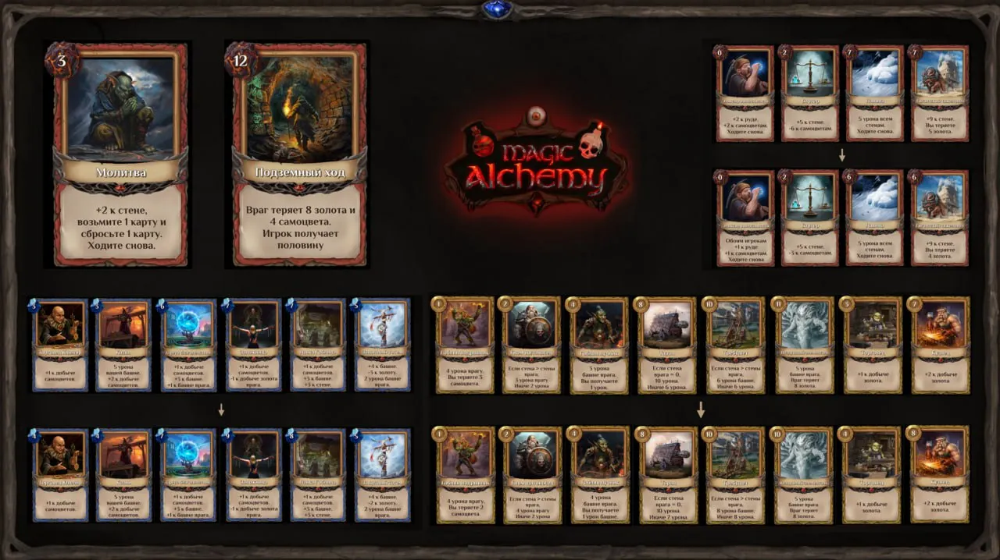
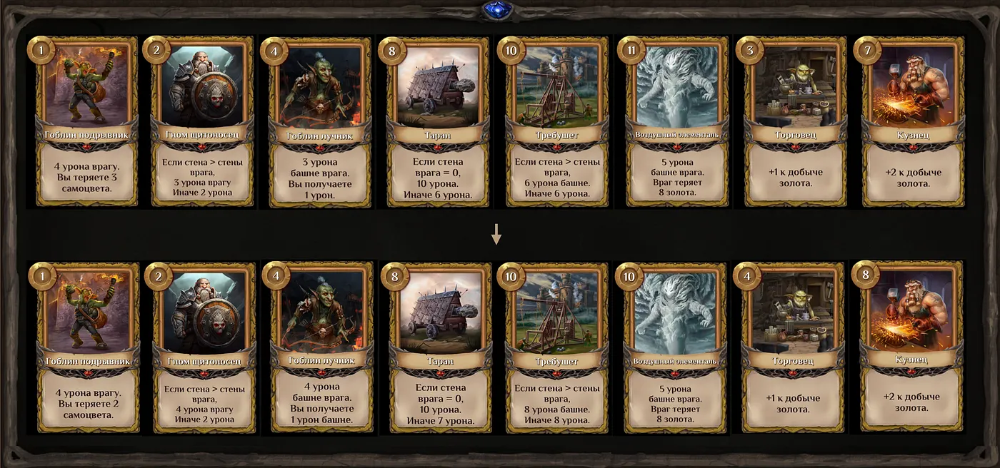
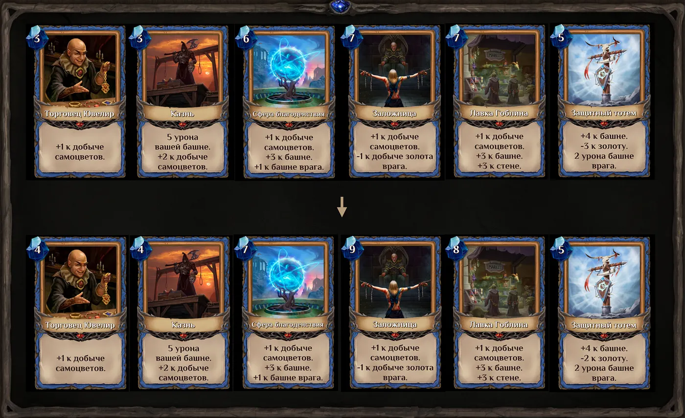
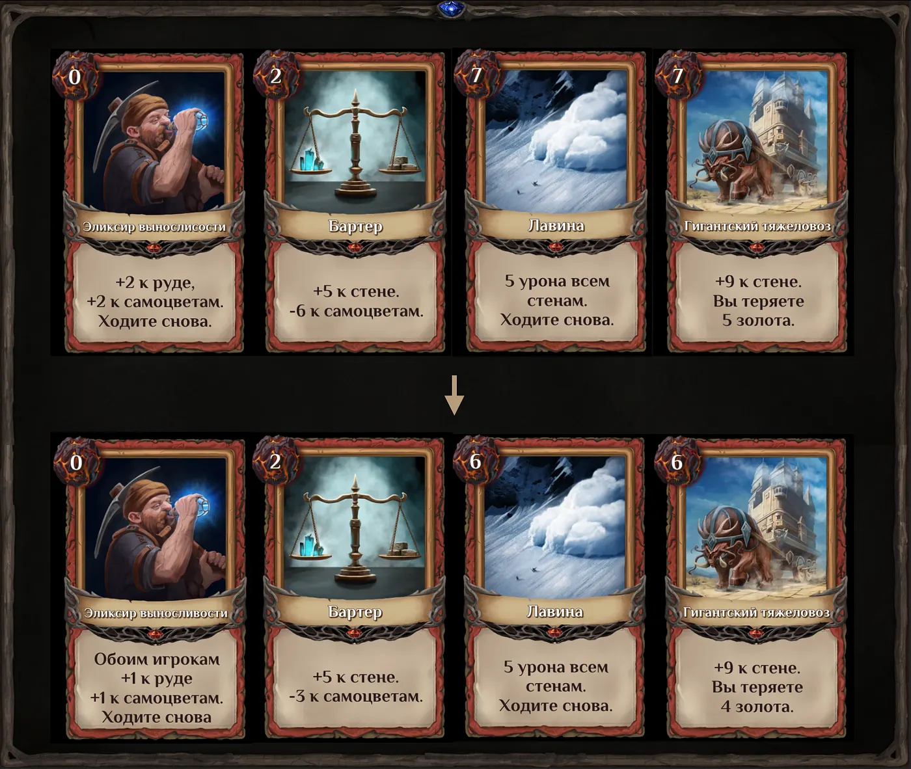
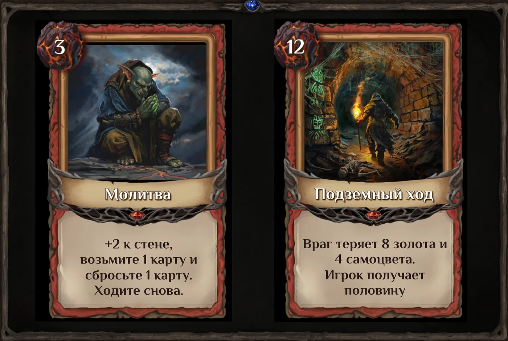

# **Ребаланс Magic Towers**

Лидерборд продолжается уже несколько недель и в целом можно сказать, что мы добились важной цели: получили очень много фидбека (конструктивного и не очень). Сотни часов тестирования и ваше мнение натолкнули нас на мысль о ребалансе некоторых карт и ресурсов. В частности, правки коснулись 18 карт из 105.

В этой статье хотелось бы подробнее пройтись по всем внедренным изменениям, чтобы игроки могли оттолкнуться от них в построении новых стратегий или корректировке старых. Поехали!

## **Что мы изменили?**

Одной из поставленных задач была “реанимация” некоторых карт, которые, согласно статистике, игроки скидывали наиболее часто: “Бартер”, “Требушет”, “Гоблин подрывник”, “Гном щитоносец” и “Гоблин лучник”. Мы хотели вдохнуть в них новую жизнь, так что немного удешевили их и увеличили урон.

Главная идея этого решения — бустануть динамику на старте игры, дать возможность напрячь соперника, который уходит в накопление ресурсов, и шанс зарашить оппонента. Категория измененных карт номер 1:

- _Карта “Бартер” теперь отнимает у вас 3 самоцвета вместо 6._
- _Карта “Требушет” теперь наносит 8 урона башне или стене врага вместо 6._
- _Карта “Гоблин подрывник” теперь отнимает у вас 2 самоцвета вместо 3._
- _Карта “Гном щитоносец” теперь наносит 4 единицы урона врагу вместо 3._
- _Карта “Гоблин лучник” теперь стоит 3 золота вместо 4, наносит 4 урона вражеской башне вместо 3, а также наносит 1 урона вашей башне._

Ко второй категории можно отнести карты “Заложница”, “Торговец драгоценностями”, “Казнь”, “Сфера благоденствия” и “Лавка гоблина”. Эти карты влияют на усиление самоцветов. Мы сделали их дороже, чтобы понерфить самоцветы по сравнению с другими ресурсами. Таким образом, некоторые из этих карт невозможно будет использовать в начале игры, придется немного подождать, однако в целом подорожание некритичное.

“Заложница” вообще является одной из наиболее имбовых карт в игре. В случае выпадения на старте партии, “Заложница” значительно увеличивала шанс выигрыша, потому что мало того, что давала рост самого нужного ресурса — самоцветов –, еще и отнимала добычу золота у противника. Мы сделали ее дороже, чтобы использовать эту карту можно было минимум на третьем ходу.

- _Карта “Заложница” теперь стоит 9 самоцветов вместо 7._
- _Карта “Торговец драгоценностями” теперь стоит 4 самоцвета вместо 3._
- _Карта “Казнь” теперь стоит 4 самоцвета вместо 3._
- _Карта “Сфера благоденствия” теперь стоит 7 самоцветов вместо 6._
- _Карта “Лавка гоблина” теперь стоит 8 самоцветов вместо 7._

Карты “Гигантский тяжеловоз”, “Лавина”, “Защитный тотем”, “Воздушный элементаль” и “Таран” относятся к среднеиспользуемым и их мы тоже решили сделать чуть более эффективными и дешевыми, чтобы у игроков было только больше мотивации задействовать эти карты в бою.

- _Карта “Гигантский тяжеловоз” теперь стоит 6 руды вместо 7 и отнимает у вас 4 золота вместо 5._
- _Карта “Лавина” теперь стоит 6 руды вместо 7._
- _Карта “Защитный тотем” теперь отнимает у вас 2 золота вместо 3._
- _Карта “Воздушный элементаль” теперь стоит 10 золота вместо 11._
- _Карта “Таран” теперь наносит противнику 7 урона вместо 6._

Две карты на увеличение золота, “Торговец” и “Кузнец”, стали немного дороже. Увеличив затраты золота и самоцветов, мы тем самым усилили значимость и эффективность руды как игрового ресурса.

- _Карта “Торговец” теперь стоит 4 золота вместо 3._
- _Карта “Кузнец” теперь стоит 8 золота вместо 7._

Отдельной категорией хотелось бы выделить карту “Эликсир выносливости”. Раньше это была самая используемая карта в игре, дававшая возможность бесплатно получить по 2 единицы ресурса (руда и самоцветы). Мы приняли решение урезать бонус, который дает эта карта.

- _Карта “Эликсир Выносливости” теперь прибавляет по одной единице руды и самоцветов вместо 2, но обоим игрокам._

Таким образом, карта стала более ситуативной.

Мы также добавили 2 новые карты, используемые за руду: “Подземный ход” и “Молитва”. “Подземный ход” стоит 12 руды, заставляет противника потерять 8 золота, 4 самоцвета и отдает половину игроку. “Молитва” стоит 3 руды, добавляет +2 к стене игрока и имеет свойство “Ходите снова”.

Эти карты были добавлены, чтобы сделать руду более полезным и ценным ресурсом по сравнению с золотом и самоцветами. По сути, это такой “ответ” синим и золотым картам: “Молитва” является аналогом карты “Шулер” и “Эльф скаут”. И хотя она стоит на 1 единицу руды дороже аналогов, зато дает +2 к стене. Это решение работает на вариативность и увеличение динамики.

“Подземный ход” является аналогом карты “Проклятье” и “Вор”. Мы сделали ее такой же по стоимости, но чуть-чуть слабее по свойствам. Почему так? Ресурс руда добывается гораздо проще остальных и карты на добычу стоят дешевле по сравнению с золотом и самоцветами.

## Немного итогов {#conclusion}

---

Еще пару слов хотелось бы сказать про ребаланс, точнее, про его основную миссию. У нас не было цели изменить баланс кардинально, вылепливая совершенно другую игру. Как говорится, “ломать — не строить”, и мы шли, в первую очередь, по пути итерационного, постепенного баланса.

Идеального баланса подобными изменениями не добиться, потому что на это в других играх часто уходят годы. Magic Towers — это казуальная игра (еще и не основная механика самой Magic Alchemy), и перед командой разработчиков не стояла задача сделать ее киберспортивной, соревновательной, с колодами и так далее. Это все не про нас :)

Более того, этот ребаланс отлично зайдет с муллиганом, так что рассматривать их нужно в связке. Кстати, муллиган мы запустим уже на следующей неделе.

В общем, основной целью этих изменений было не сломать то, что и так работает, улучшить уже имеющиеся механики и чуть подправить явно дисбалансные карты вроде “Заложницы” или “Эликсира выносливости”. Пишите, что думаете, и как стали проходить ваши партии относительно игр до ребаланса. Мы всегда тщательно прислушиваемся к мнению коммьюнити, чтобы ваш игровой опыт был как можно более приятным.

Не забывайте подписываться на соцсети проекта Magic Alchemy: [Twitter](https://twitter.com/magicalchemydao) | [Discord](https://discord.gg/MMdJ9zw6cc) | [Telegram](https://t.me/btcbabytrader)
