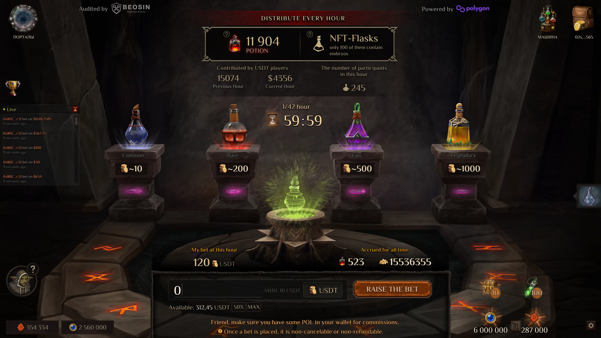
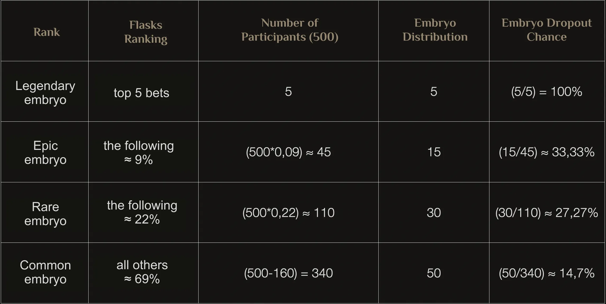
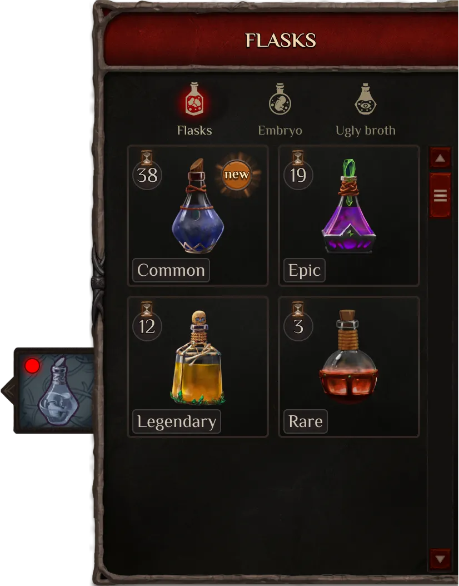
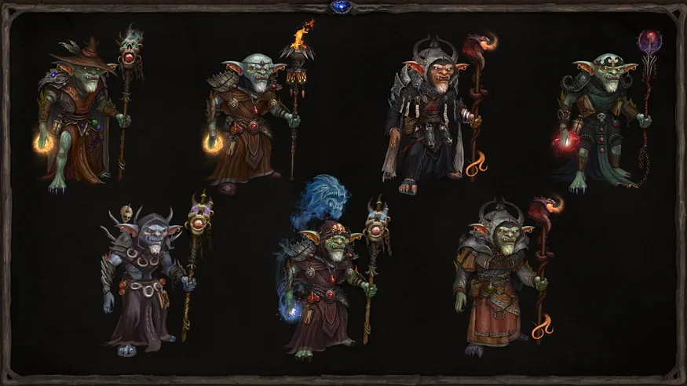

# Token and NFT Marathon by Magic Alchemy

Welcome, Alchemists!

After years of hard work and dedication developing our game, Magic Alchemy, we are finally on the brink of the milestone event that precedes the game’s full release. This is the public sale of POTION tokens and the key game characters — NFT Alchemists.

Public token sales are always significant for any Web3 project, as they allow anyone interested to support a project they believe in while accessing tokens at a favorable rate.

Our approach is no exception, but from the beginning, we’ve committed to innovation and unique approaches in development. For this reason, we’ve designed a token auction unlike any other, combining it with the sale of core in-game characters.

This stage will be structured as an auction where players bid against each other for POTION tokens and NFT Alchemists. Running for a full 42 hours, we’ve named it the “Token and NFT Marathon.” With this extended timeframe, everyone who wants to participate will have the chance to join.

**Why did we choose this unique format for POTION’s public sale?**

An auction provides an exciting and transparent way for the gaming community to determine the initial token price, free from large funds or market makers — just your strategy and bid. Over the course of 42 hours, players will battle for rare NFTs and tokens, with each choice directly impacting their success. This auction format gives everyone equal footing.

Another reason not to miss the Token and NFT Marathon is the chance to earn $RUSK, gems, points, and loot boxes as rewards for participating. The more involved you are, the more in-game rewards you can secure.

## The Importance of Community and its Role in our Game
We believe that our “early birds” — the first supporters of our game — are our greatest asset. Thanks to you, our community, we were able to confirm our vision and approach to creating Magic Alchemy. Your feedback and ideas have shaped many of our developments. In this sense, our community is truly a co-creator of this game.

Thus, we believe that early supporters have earned special recognition. This can be expressed not only in exclusive in-game items and characters but also in potential material advantages.

Early participants who acquire POTION tokens through the Token and NFT Marathon will have the opportunity to be among the first to provide liquidity in Magic Alchemy’s farming feature. As we aim to position ourselves as a gamified DEX, many DeFi mechanics will be integral to our game, including high APR rewards for those who provide liquidity at the launch of the POTION/USDT pool. This offers early players a chance to grow their assets.

We, as the development team, understand the significance of the Token and NFT Marathon for the entirety of our game. Ideally, we would launch it during a “bull run,” but current market realities tell a different story.

On the other hand, with the market currently at its lowest point, it could be a prime moment for our community to participate in the Marathon and secure POTION tokens at an optimal price. We hope that if the crypto market has indeed hit its lowest point, there will soon be growth, and our shared journey will set sail on the winds of the next bull run.

Since the release of our alpha (Dec 2023), it has been nearly a year. We have intentionally refrained from selling NFTs or tokens, instead opting for a “Win-Win” approach through free USDT rewards (card tournaments) and NFT distributions (mugs, goblins, carts).

Initially, we focused on giving back and building a strong community, and now we’re at the stage where you, our community, can support us — not through donations, but by participating in this thrilling event.

Now, let’s dive into the mechanics of the Token and NFT auction.

## The POTION Token Auction

A total of **500,000 POTION tokens** and **100,000,000 $RUSK** will be distributed through the Token and NFT Marathon. The Marathon will last **42 hours**, meaning approximately **11,904 POTION tokens** will be sold each hour, with an additional **2.38 million $RUSK** allocated as a bonus (not sold).

Players who place bids will participate in the distribution of tokens during the specific hour in which their bids are made. Additionally, players will receive Mendelef NFT Flasks for their bids, which we will discuss later.

It’s important to note that all token auction bids are **non-refundable and cannot be canceled**.

## POTION Token Distribution Mechanics
Imagine Onotole decides to participate in the 10th hour of the Marathon and places a $100 bid. During this hour, the total bids amount to $15,600. Here’s how the tokens are calculated:

**POTION Calculation:**
$100 / $15,600 × 11,904 POTION ≈ 76.3 POTION

**$RUSK Price Calculation:**
$15,600 ÷ 2.38M $RUSK = 0.0065

**$RUSK Calculation:**
$100 ÷ 0.0065 = 15,384 $RUSK

For his $100 bid, Onotole will receive approximately **76 POTION** tokens and **15,384 $RUSK**.

To make things simpler, all key details are displayed, including the USDT amount you’ve bid. This ensures you can make well-informed decisions during the bidding process.

## NFT Auction

Simultaneously with the public sale of POTION tokens, an auction will be held for distributing Mendelef NFT Flasks. This is part of the same auction as the token sale. Players placing bids in this auction can not only earn tokens but also have a chance to acquire a primary character — the Goblin Alchemist. Only by owning this character will players be able to participate in the core DeFi component of Magic Alchemy.

For some participants in the Marathon, the main goal may be the token acquisition itself, with NFTs being a welcome bonus that can be immediately placed on the market. However, we believe that, for most players, the hunt for unique NFT alchemists will be the primary goal of the marathon.

There will be a total of 4,444 Genesis NFT Alchemists in the game, divided into four ranks:

* Common — 2,222 units
* Rare — 1,342 units
* Epic — 660 units
* Legendary — 220 units

Epic and legendary alchemists will be about four times rarer than common and rare ones. This rarity isn’t just for show — these alchemists won’t only have unique artwork but will also come with special gameplay benefits, particularly in relation to in-game guilds, a feature we’ll reveal more about in future articles.

The Marathon will last for 42 hours, allowing ample opportunity for everyone to participate. Each participant can receive only one Mendelef Flask per hour, meaning one person could potentially collect up to 42 Mendelef Flasks with up to 42 Goblin Alchemist embryos.

A total of 4,200 NFT Goblin Alchemist embryos will be distributed, though the number of Mendelef Flasks will exceed this count. The reason for this will be clarified below.

Each hour, among all minted Mendelef Flasks, the following will be distributed: 5 legendary, 15 epic, 30 rare, and 50 common alchemists. So, each hour, a total of 100 Goblin Alchemist embryos will be included in the flasks.

Additionally, 244 Goblin Alchemist embryos (10 legendary, 30 epic, 82 rare, and 122 common) will automatically be placed in the treasury. This pool of 244 NFTs will form a reward fund for various marketing campaigns and other giveaways.

## Mendelef Flask Distribution Mechanic
The distribution of Mendelef Flasks will depend on the size of each participant’s bid.

The minimum bid to receive a common Mendelef Flask is set at 10 USDT. Placing this bid guarantees that the participant will receive one. Within each hour, participants may increase their bid amount. The higher the bid, the greater the chance of receiving a higher-ranked flask.

For example, if there are 500 participants in a particular hour of the Marathon, the distribution across Flask ranks will look like this:

* **Legendary Flasks** (Top 5 — guaranteed legendary alchemist embryos)
* **Epic Flasks** (Next ~9% — 15 epic alchemist embryos)
* **Rare Flasks** (Next ~22% — 30 rare alchemist embryos)
* **Common Flasks** (Remaining participants — 50 common alchemist embryos)

This unique structure creates an exciting competitive environment, encouraging players to strategize and enhance their experience while vying for some of the rarest NFTs in Magic Alchemy.

It’s important to note that the chances of a Mendelef Flask containing an alchemist embryo may vary depending on the number of participants each hour. There is no maximum limit on the amount of USDT a participant can contribute. **The higher the contribution amount, the higher the likelihood of getting a flask of higher rarity and consequently with a higher chance of dropping a embryo inside.**

From 100 and up to 167 bets the math of calculating the presence of an embryo in flasks without interest, you might say. As long as 22% of the distribution of rare flasks/embryos from the total number of bets, is less than distributed 30 rare embryos to a flask per hour, then rare flasks and respectively embryos contained in them are exactly 30, and epics 15. When 22% is more than 30 bets, but 9% is less than 15 bets, then rare by percent counts, and epics are always 15. When there are 167 or more bets, everything is counted by percentages.

The exact methodology for distributing alchemist embryos depends on the number of participants each hour. For instance, if only 100 people participate in a particular hour, every Mendelef Flask will contain an alchemist embryo.

All participants in the Auction (Alchemy Mint) will receive an NFT Mendelef Flask.

Following the Alchemy Mint, we’ll enter the Transmutation of Flasks stage. Here, Mendelef Flasks will transform, revealing either an alchemist embryo or merely parts of goblin anatomy. **It’s at this point players will finally learn what’s hidden inside their flask** — but more on that in the future!

What we can reveal now is this: Ugly Flasks (those with goblin parts) will be essential to creating a full-fledged adult NFT goblin alchemist. So, players shouldn’t be discouraged if they receive an Ugly Flask instead of an alchemist embryo — these flasks will play a vital role and may even be as in-demand as the alchemists themselves.

At the start of each hour, the base floor price for all flasks will be set at 10 USDT. However, as Marathon participants place their bids, the floor prices will adjust accordingly. Notably, the floor for common flasks will remain at 10 USDT.

Let’s dive into some example strategies to illustrate potential approaches to winning a coveted NFT Goblin Alchemist.

Imagine that our familiar player, 0notole, decided to aim for an Epic Mendelef Flask, as the odds of finding a goblin alchemist embryo are higher in these flasks. Midway through the hour, he noticed that the floor price for securing an Epic Flask was around 60 USDT. After some quick mental calculations, he compared this to the previous hour’s floor price and decided to place a bid of 90 USDT.

Confident in his strategy, he stepped away, only to return at the hour’s end and find that the Epic Flask floor had risen to 110 USDT. Now, instead of an Epic Flask, he was on track to receive a Rare Flask at his bid of 90 USDT — despite the Rare Flask floor for that hour starting at 20 USDT. Realizing this, 0notole rushed to raise his bid, but with many players attempting the same strategy in the final minutes, floor prices surged across the board. Ultimately, he needed to bid 130 USDT to secure an Epic Flask.

Meanwhile, another player, Vasily, decided on a different approach. With a modest bankroll, he opted to skip the Epic and Rare Flasks, which he could only afford in limited numbers. Although these flasks offered a better chance of containing an alchemist embryo, there was still no 100% guarantee.

Instead, Vasily chose to participate across as many hours as possible, placing the minimum bid of 10 USDT to guarantee a Common Mendelef Flask each time. His strategy was to increase his odds of obtaining a goblin alchemist embryo by maximizing the number of Common Flasks he collected. After estimating the probability of obtaining embryos from Common Flasks, he calculated that, with 20 Common Flasks, he might expect to receive around 3–4 embryos.

As shown by these examples, alongside the token auction, there is plenty of room for players to develop their own individual strategies in the Token and NFT Marathon.

We’re confident that every participant in the Token and NFT Marathon will appreciate the innovation we’re bringing and enjoy a truly one-of-a-kind experience, brimming with excitement, competition, and strategic depth.

Here, everything depends on you! In this 42-hour auction, tokens and NFTs are distributed in an open, fair competition — no influence from large funds or insiders. You set the starting price and compete for rare NFTs on equal footing with others. This is a unique opportunity to become an owner of exclusive tokens and NFTs and to prove that your strategy reigns supreme!

## I Am Legend
We want to share the value and utility of our Alchemists. As mentioned earlier, the game will feature **4444 NFT Genesis** Alchemists, divided into 4 rarities:

* **Common** — 2222 units
* **Rare** — 1342 units
* **Epic** — 660 units
* **Legendary** — 220 units

The primary value of Alchemists lies in the fact that **only their owners can participate in the core DeFi mechanics of Magic Alchemy**. We position ourselves as a gamified DEX platform, and it seems we’ve succeeded in creating a new gaming genre — **LP2Play**.

In short, the essence of this genre lies in players adding liquidity to the **cauldron (pool)** in the form of game potions (in-game tokens). By “brewing” these potions, they compete for rewards. At the same time, players progress through the storyline using various in-game mechanics. You can read more about the DeFi aspect of the game **here**.

Another key feature of the Genesis Alchemists is their exclusivity and the uniqueness of their artwork. Each character has been meticulously hand-drawn by our lead artist, a process that took several months of dedicated effort. No two characters in the game will have the same design — this applies not only to the Alchemists but also to other in-game characters like Repairmen and Gardeners. We’re confident that collectors will be eager to add these one-of-a-kind goblins to their collections.

## What are the amazing unique features of Legendary NFT Alchemists? Let’s break it down step by step!

**I**. After the Marathon, players will enter a new phase where they can stake their Alchemists and earn rewards in POTION tokens. The reward multipliers will vary depending on the rarity of the Alchemist.

**II**. Different rarity levels of Alchemists determine their stamina levels, which influence how many game tokens can be farmed without a reduction in farming speed. For example, a Legendary Alchemist can farm 14% more tokens without penalty compared to a Common Alchemist. This aspect is explained in more detail in the article about the DeFi mechanics of the game.

**III**. Only owners of Epic and Legendary Alchemists will have the ability to create guilds within the game. Guilds will have a dedicated leaderboard with seasonal rewards. This makes participation in guilds even more rewarding, as players can earn prizes from both individual and guild leaderboards.

**IV**. Increased POTION rewards. Guildmasters whose guilds secure top positions in the guild leaderboard will receive higher rewards.

**V**. Share of rake from paid games. Legendary Alchemist owners will receive a portion of the revenue from rake in the paid game mode. This mode, similar to a paid poker format, will allow players to place bets in USDT (before the game’s release) or POTION (after release) and compete in the card game Towers.

**VI**. Future drops and beyond. Exclusive NFT drops are planned for Legendary Alchemist owners. These drops will extend not only to Magic Alchemy but also to future games by the studio!

Alchemists in Magic Alchemy are not just game characters but essential elements of the game’s economy and competitive dynamics. Thanks to their utility, scarcity, and uniqueness, they grant access to an exciting gameplay experience while offering numerous opportunities for progression and earning.

We’re confident that every Alchemist owner — be it Common or Legendary — will find something they love in the game, from engaging in DeFi mechanics to collecting one-of-a-kind artworks. Owners of the rarest Legendary Alchemists, however, will enjoy unparalleled advantages, from increased rewards to exclusive features.

Magic Alchemy is continuously evolving, and even more content, mechanics, and updates are on the horizon. Stay tuned for news, and prepare to conquer the world of Dji’Da with your Alchemists!