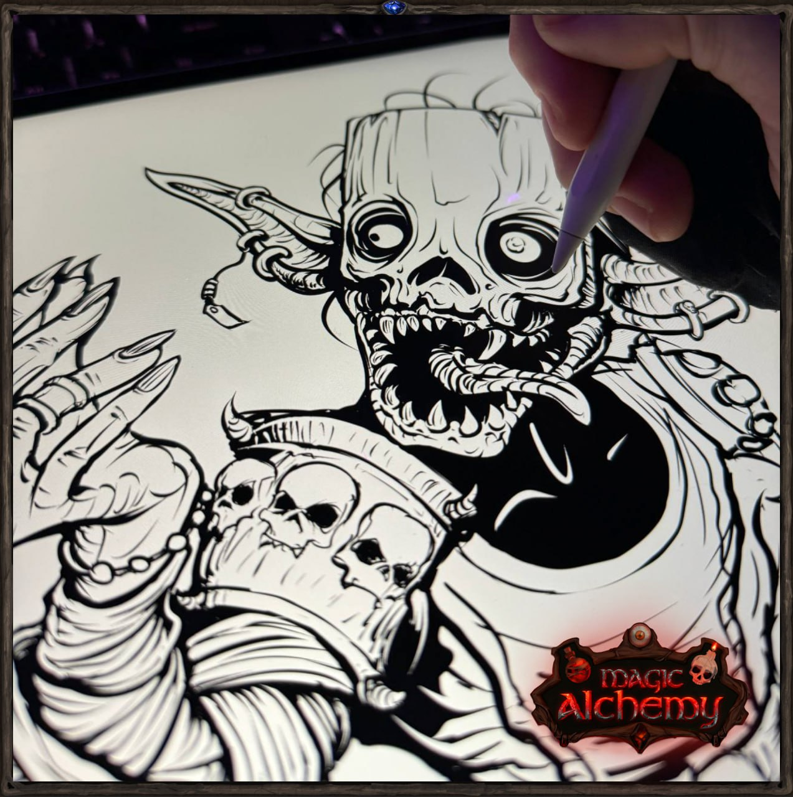
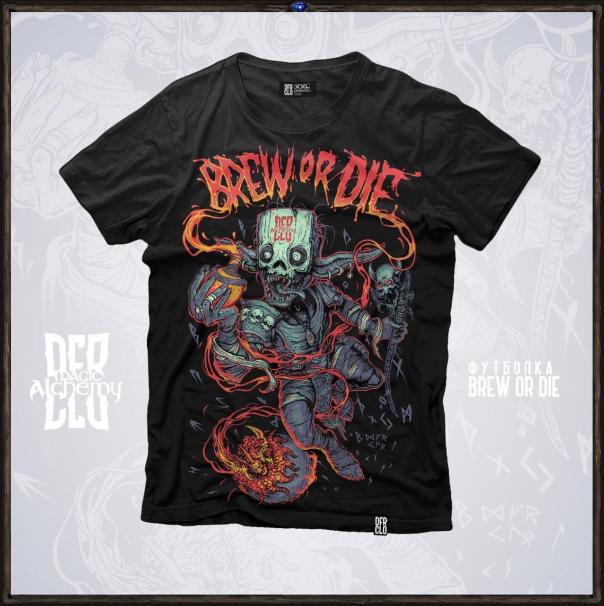
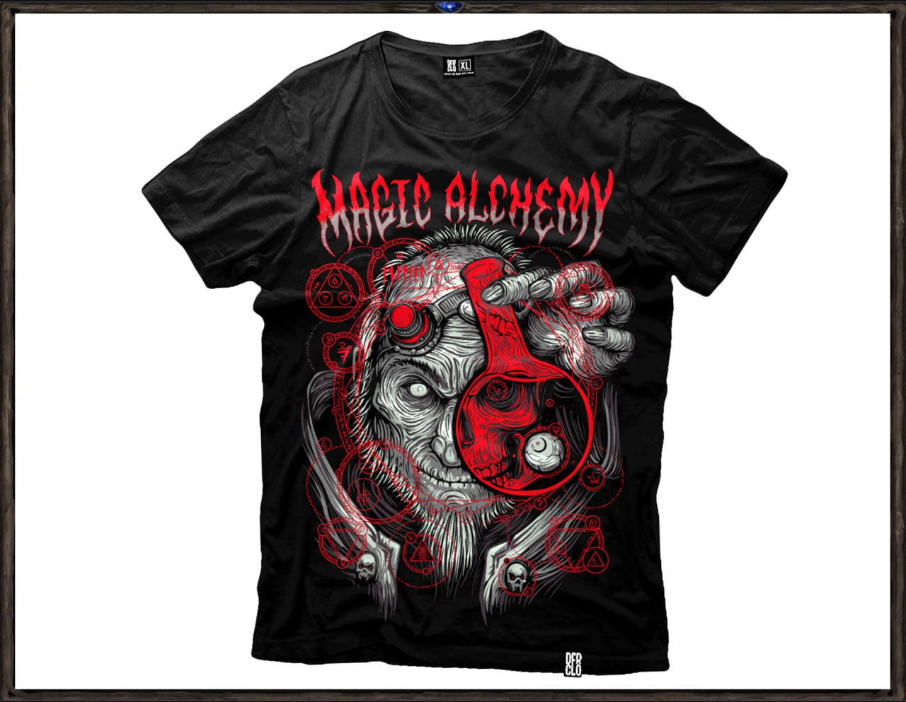

# Merch You Can’t Buy

We set out to create unique merch that wouldn’t just gather dust in a wardrobe, but instead become the perfect gift for players and an inseparable part of the game itself. At first, we printed t-shirts with our logo and some artworks and even gave away a few. But after a while, I realized they were missing that very magic we pour into our game.

That made me think: why should our approach to merch be any different from our approach to the game? Many would say, “It’s just a t-shirt.” But I realized that merch is just another part of the game — only in real life. It has to be just as cool, carry the same vibe, and reflect the same attention to detail. The materials must be premium quality, and the art should mesmerize, tying back to the lore of our world.

We joined forces with the incredibly talented artist and designer Pavel Kurbanov (https://vk.com/dfr_clo) to create something truly unique. This collaboration is a reflection of our game’s DNA, an embodiment of our story in art. Every detail hides a piece of lore — from dwarven runes to the main antagonist. On the t-shirts, we depicted the Blood Alchemist, striving to create the Alpha Elixir powerful enough to lull even a god to sleep.

### Presenting the First Magic Alchemy Collection — “Blood Alchemist.”

This collection won’t be for sale - only for winning. That’s the way we chose to share a spark of our passion with you, our players. And I truly believe you’ll love it.

Our limited collection emphasizes exclusivity. We intentionally kept the print run small, making these shirts not just merchandise, but trophies — something you can only win. Each new collection will reflect a different part of our game and story, a journey we live through together with you, our cozy Magic Alchemy community.

### The Second Limited Merch Collection from Magic Alchemy - “Elixir of Madness.”

The first “Blood Alchemist” collection became a true trophy - not just a t-shirt, but an artifact from the world of Magic Alchemy, a continuation of the game in reality. And now we’re ready to unveil the second chapter of this magical story.

Together with Pavel Kurbanov, we created a new print inspired by Shadow Alchemy - a forbidden practice where knowledge is gained at the cost of sanity.

Every detail of the shirt is a reference to the world of Dji`Da: symbols, heroes, energy. It’s not just style - it’s a story woven into fabric.

Only the most active, dedicated, and passionate players will have a chance to claim this piece of history for themselves.

Each item of merch is given not simply as an object, but as a reward - earned through your journey, your dedication, and your passion for the world we are building together.