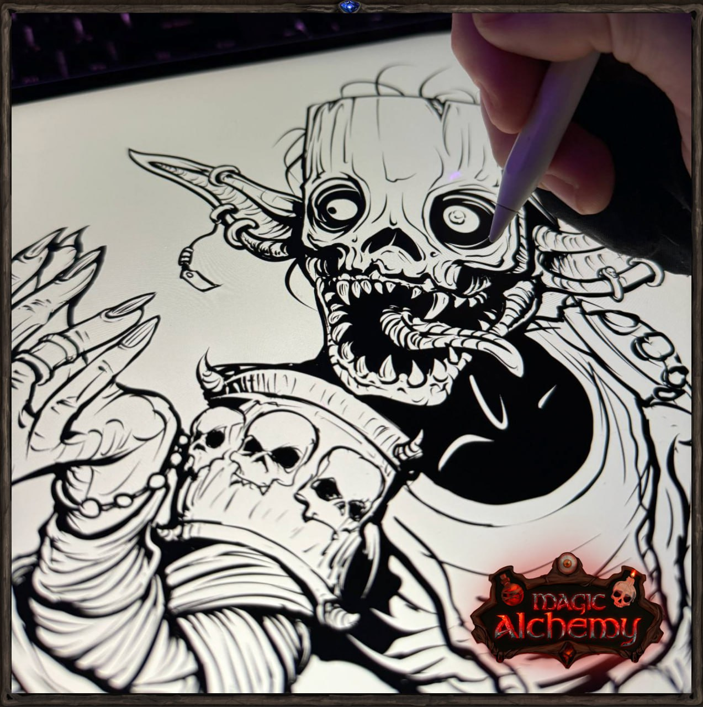
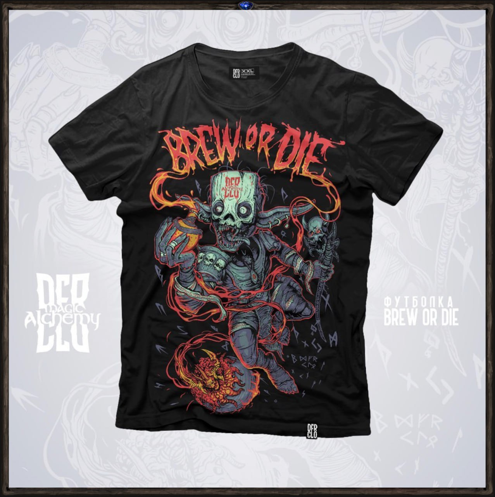
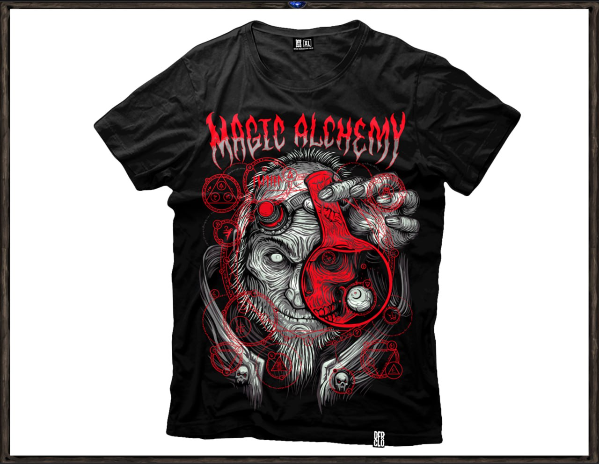

# Мерч, который не купить

Мы взялись за создание уникального мерча, который не пылился бы на полке гардероба, но стал бы идеальным подарком для игроков и неотъемлемой частью игры. Сначала мы распечатали футболки с лого и некоторыми артами и даже раздали парочку, но спустя какое-то время я ощутил, что в них отсутствует та самая магия, которую мы создаем в нашей игре. 

Это заставило меня задуматься: почему наш подход к созданию мерча должен быть иным, чем к игре?  Хотя многие скажут, что это всего лишь футболка, я осознал, что мерч — это такой же элемент игры, только в реальной жизни. Он должен быть таким же крутым, передавать тот самый вайб и внимание к деталям. Материалы должны быть премиум качества, а арт — завораживать и отсылать к лору мира. 

Мы объединились с невероятно талантливым художником и дизайнером Павлом Курбановым (https://vk.com/dfr_clo), чтобы создать нечто уникальное. Эта коллаборация — отражение ДНК нашей игры, воплощение нашей истории в арте. В каждом элементе дизайна скрыта история, от рун гномов до главного антагониста. На футболках мы отобразили Алхимика Крови, стремящегося создать альфа-эликсир, чтобы усыпить самого бога.

### Встречайте первую коллекцию Magic Alchemy — «Blood Alchemist».

Эту коллекцию нельзя будет купить — только выиграть. Такой мы придумали способ поделиться частицей страсти с вами, нашими игроками. И я верю, что вам понравится.

Наша лимитированная коллекция подчеркивает эксклюзивность. Мы намеренно ограничили тираж, делая эти футболки не просто товаром, а трофеем, который можно только выиграть.  Каждая новая коллекция будет отражением части нашей игры и истории, которую мы рассказываем и проживаем вместе с вами, ламповым коммьюнити Magic Alchemy.

### Вторая лимитированная коллекция мерча от Magic Alchemy — “Elixir of Madness”

Первая коллекция «Blood Alchemist» стала настоящим трофеем — не просто футболкой, а артефактом из мира Magic Alchemy, продолжением игры в реальности. И теперь мы готовы представить вам вторую часть этой магической истории.

Вместе с Павлом Курбановым мы создали новый принт, вдохновлённые алхимией теней — запретной практикой, где ради знаний жертвуют рассудком.

Каждая деталь на футболке — это отсылка к миру Джи`да: символы, герои, энергия. Это не просто стиль — это история, зашифрованная в тканях.

Только самые активные, вовлечённые и преданные смогут получить шанс забрать эту часть истории себе.

Каждый мерч вручается не как вещь, а как награда, за которой стоит путь, вовлечённость и страсть к нашему общему миру. 
