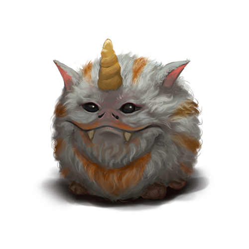

# О существах магических. Часть 2
Данная информация по вновь обретенным магическим существам составлена на основе немногочисленных сохранившихся древних записей и дополнена исследованиями члена Верховного Магического Совета Академии Анкорлана, Виталиусом, а также ученых Ордена Ищущих Истину. В древних хрониках не указано, для каких целей содержали магических существ. Тем не менее, неоспоримым фактом является то, что все они были ручными фамильярами магов и алхимиков прошлого.

## Зубастик

Будущий хозяин Зубастика, вас не должна напугать его весьма грозная пасть, сплошь усеянная острыми, как бритва, зубами. Трудно отыскать существо более доброе и покладистое. Зубастики крайне послушны и замечательно поддаются дрессировке. Они очень привязываются к своим хозяевам.

Удивительной особенностью Зубастиков является то, что они могут съесть (я бы даже сказал “поглотить”) любой, даже несъедобный предмет, который окажется у них в пасти. В уцелевших древних записях упоминается некое “субпараллельное карманное пространство”, но что это такое, к сожалению, нам уже неведомо. Эксперименты показали, что все то, что съедал Зубастик, исчезало в его пасти безвозвратно. Мой совет: если хотите завести себе такого фамильяра, прячьте все ценное подальше.

В моей голове появилась отчасти безумная, но очень прогрессивная в своем подходе идея: засунуть в пасть Зубастика гоблина, привязанного крепкой и длинной веревкой к столбу в вольере, чтобы исследовать это так называемое “карманное измерение”.

К моему глубочайшему сожалению, добровольцев не нашлось. Прискорбно. Сама идея провести такой эксперимент представляется мне крайне интригующей. Лезть же в пасть Зубастика самостоятельно я считаю делом неосмотрительным. В случае несостоятельности моей теории, наука может лишиться невероятно талантливого и преданного ученого, который не щадит себя в деле служения ей.

Физиология Зубастиков также очень необычна. Пасть занимает большую часть тела, при этом животное функционирует, скажем так, абсолютно нормально. Для меня сразу становится понятна магическая природа их появления на свет, так как обычное существо не смогло бы существовать с такими пропорциями тела.

Мне не терпелось провести вскрытие тела одного из Зубастиков, чтобы подтвердить свою теорию, однако гоблины в весьма агрессивной манере пообещали превратить меня в овцу, если хоть что-то случится с их драгоценными фамильярами.

Я, бесспорно, на многое готов ради науки, но проверять на практике, являются ли их угрозы шуткой, не решился. К тому же, после этого пренеприятного разговора рядом с моей лабораторией стало пастись стадо овец, которого раньше я там не наблюдал. Совпадение? Если да, то определенно подозрительное.