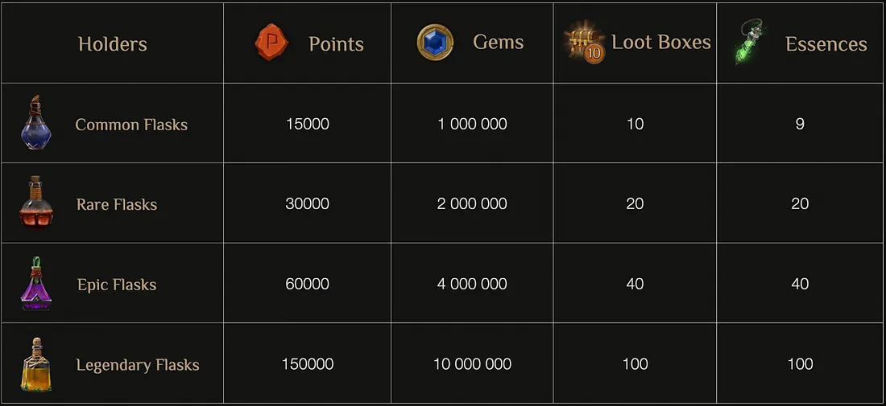
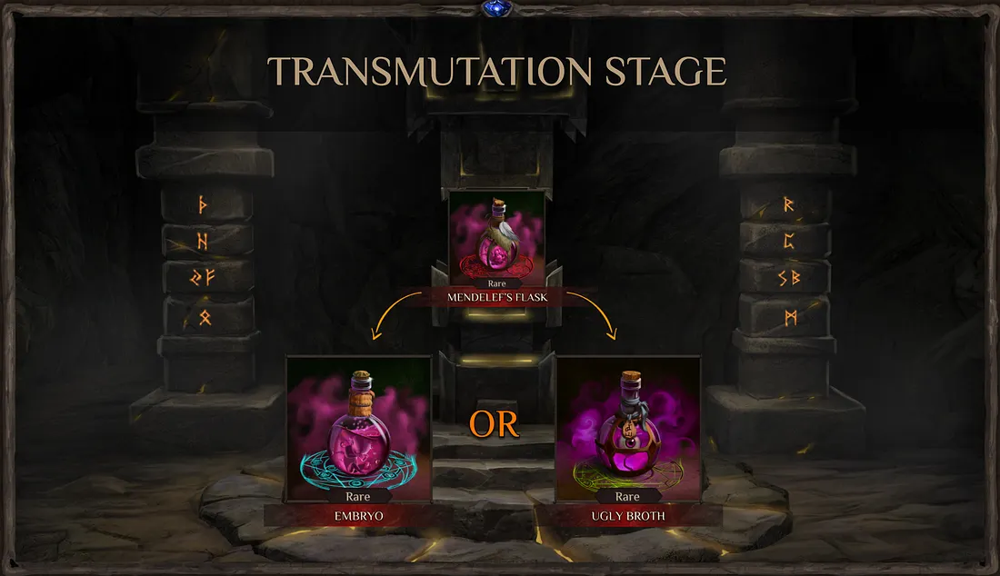
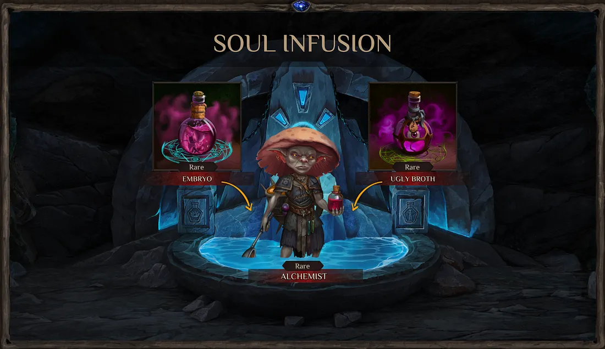
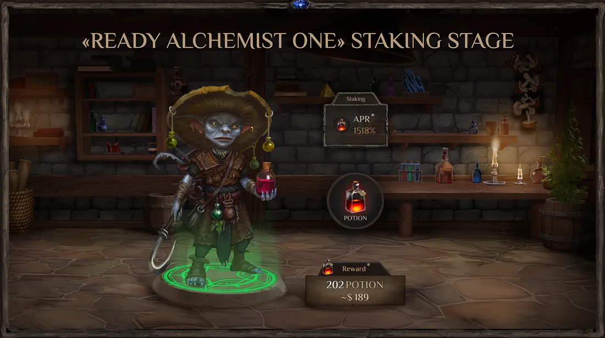
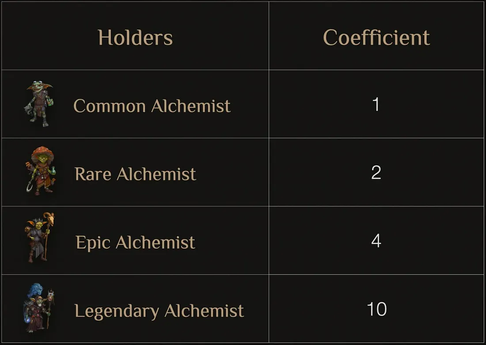

# Post-Token and NFT Marathon Stages
Magic Alchemy

Greetings, Alchemists!

In this article, we’d like to dive into the upcoming stages following the Token and NFT Marathon. Believe us, these next phases will be just as thrilling and engaging as the Marathon itself.

But first, a quick update to our [previous article](../marafon_2/marafon_en.md). We’ve decided to add extra in-game rewards for all participants of the Token and NFT Marathon.

For example, if you place a $30 bid during the Marathon, by the end of that hour, you’ll receive $30 worth of POTION tokens, a rare NFT — the Mendelef Flask, and additional in-game rewards, such as 30,000 points, 2,000,000 gems, 20 loot boxes, and 20 essences.

This means that Marathon participants will be able to immediately see the benefits of their engagement and make use of these rewards right away in the current game stage. All of this, once again, introduces new strategic elements for players participating in the Marathon.

Here’s the complete table of in-game rewards for each hour of Marathon participation, based on the rank of your Mendelef Flasks. Take note of the rewards for each flask! During the Marathon, you can purchase up to 42 flasks.

**Prior to the start of the Marathon, numbers may be slightly adjusted.*

An important update for the Token and NFT Marathon: we’ve decided that the first hour of the Marathon will actually last four hours. This gives all participants time to get familiar with the interface and mechanics, and allows us to double-check everything from a technical standpoint. After that, each subsequent hour will last exactly one hour.

During the Marathon and subsequent stages, you’ll encounter Mendelef Flask NFTs, Alchemist NFTs, and the so-called “Ugly Broths,” each with varying rarities and appearances. You can explore their types and visuals in this table:

We’ll dive into each of these components separately a bit later. For now, let’s jump right into the stages ahead.

## The Transmutation of Flasks
Approximately a week after the Token & NFT Marathon (subject to change), we’ll launch the next phase: the Transmutation of Mendelef Flasks. In this phase, each Mendelef Flask can be transmuted into either an NFT alchemist embryo or an Ugly Broth (a flask containing goblin body parts).

This phase will unfold in a new sub-location, the Relic of Transmutation, located within the Mendelef’s Abode.

**Here’s how it works:**

* From a Common Mendelef Flask, you might get either a common alchemist embryo or a common Ugly Broth.
* Similarly, rare and epic flasks can yield rare and epic alchemist embryos or Ugly Broths.
* Only legendary flasks are guaranteed to produce a legendary alchemist embryo with a 100% success rate.

We covered the probability calculations for obtaining an alchemist embryo from a Mendelef Flask in the [previous article](../marafon_2/marafon_en.md). Chances are tailored to each hour and each flask rarity.

The metadata of each NFT will retain information about the specific hour it was obtained, recorded in its attributes (NFT Trait). Players can easily check these details by connecting their wallets to view their collection on our marketplace or other compatible marketplaces like element.market.

The Relic of Transmutation will remain accessible until the game’s end, so you can transmute your Mendelef Flasks at any time. There’s no rush; even if you find untapped flasks in your wallet months later or buy such NFTs on the marketplace, you’ll still be able to transmute them.

## The Soul Infusion
The next phase, launching approximately a week after the Flask Transmutation (subject to change), is called the Soul Infusion. This will also take place in a new area — the Fountain of Life.

In the world of Dji’Da, every mortal is endowed with a soul — the essence of conscious life. The soul is a fragment of the Mana flame, the universal energy that the deity Tara shared with all her children. Therefore, our embryos need a soul to truly come alive. The Soul Infusion phase is dedicated to this very process.

In the Fountain of Life, players will combine an NFT alchemist embryo with an NFT Ugly Both to create the game’s main character, the NFT goblin alchemist.

* A common embryo requires a common Ugly Broth, a rare embryo needs a rare Ugly Broth, and so on. Only for the legendary NFT alchemist embryo will an epic Ugly Broth be needed.

This mechanic is carefully designed to add value to NFT Ugly Broths, especially for players who were less fortunate during the Transmutation and only received Ugly Broths from their Mendelef Flasks. This creates a market demand for these NFTs, giving players a chance to sell them on the secondary market, especially the epic Ugly Broths, as they’re required for legendary alchemists.

Our team has run different models of the Token & NFT Marathon and anticipated that some scenarios could lead to a shortage of epic Ugly Broths. In these cases, we’re prepared to activate a mechanism for trading several common Ugly Broths for one epic. This ensures that all players have a way to create a complete NFT goblin alchemist.

We’ll reveal more details about this exchange mechanism should the need to implement it arise.

## Ready Alchemist One!
Our next stage, titled “Ready Alchemist One!”, will kick off shortly after the Soul Infusion phase. In this stage, players will unlock a new game location — the Workshop — where you can start using your alchemist to earn additional rewards in POTION tokens.

As a gamified DEX exchange, we aim to familiarize our player community with key concepts and mechanics typical of these exchanges. One fundamental concept is staking.

In general, staking involves locking up crypto assets for a certain period, allowing participants to gain validator status within the blockchain network where their assets are locked. Validators are responsible for verifying transactions, ensuring the blockchain operates smoothly, and are rewarded with new crypto for their services.

**In our game, players will stake their NFT alchemist** on our smart contract and receive POTION token rewards. These rewards will come from a designated reward pool outlined in our tokenomics and will be subject to a lock period.

All rewards earned through staking an Alchemist will be directly **recorded within that NFT Alchemist.**
Accordingly, the more POTION tokens the Alchemist farms — which directly depends on its rarity — the more valuable it can become on the market, even before the game officially launches.

This mechanic implies that the price of such Alchemists, with POTION tokens “embedded” in them (earned during the “Prepare the First Alchemist” phase), can increase proportionally with the rise in the POTION token’s value.

As a result, an OTC (Over-the-Counter) market is likely to emerge — a trading space outside of official exchanges where deals are made directly between parties.
This would essentially function as a derivatives-like market for these Alchemist NFTs, based on their embedded token value.

The “Ready Alchemist One!” stage is expected to last until the game’s full release (from one to several months). Anyone with an NFT goblin alchemist in their wallet can join, even those who missed the Marathon.

Our goals for this stage are twofold. First, to allow more people to engage with our game, use the DEX mechanics, and earn token rewards. Second, to drive demand on the secondary market for our entire NFT collection. Those who missed the Marathon but want to earn game tokens by staking an alchemist may purchase one, or the embryos and Ugly Brews, on the marketplace.

Each rarity level of the alchemist NFT will have specific staking coefficients, allowing participants to see the number of POTION tokens they can earn per day based on these coefficients. And rest assured, the annual percentage yield (APR) for staking an alchemist will likely be highly attractive.

**Prior to the start of the Marathon, numbers may be slightly adjusted.*

**To understand the reward distribution mechanics, let’s look at the following example:**

Let’s assume that 8,000 POTION tokens are distributed daily.
If, on the first day, 10 Legendary Alchemists are staked, then each of them will receive 800 tokens per day.

Since this is **NFT staking** (not token staking), the APR will be calculated based on the value of the Alchemist NFT (using a separate formula).
The POTION token price will be derived from the formula:
380920 / 500000 = 0.76 / 2 = 0.38.

In other words, you just need to determine the value of the Alchemist in POTION (at $0.38 per token) — and the APR will be calculated based on that value.

Each wallet address will be able to stake only one alchemist.

As you can see, we’re committed to bringing innovation and fresh twists to fundamental mechanics like crafting and staking. We’ve worked to ensure that everyone participating in the Marathon gains new experiences and a deeper understanding of Web3.

Together, these stages and new mechanics will demonstrate that taking part in the Token & NFT Marathon will be not only immensely engaging and rewarding but also a potentially profitable experience for every participant.