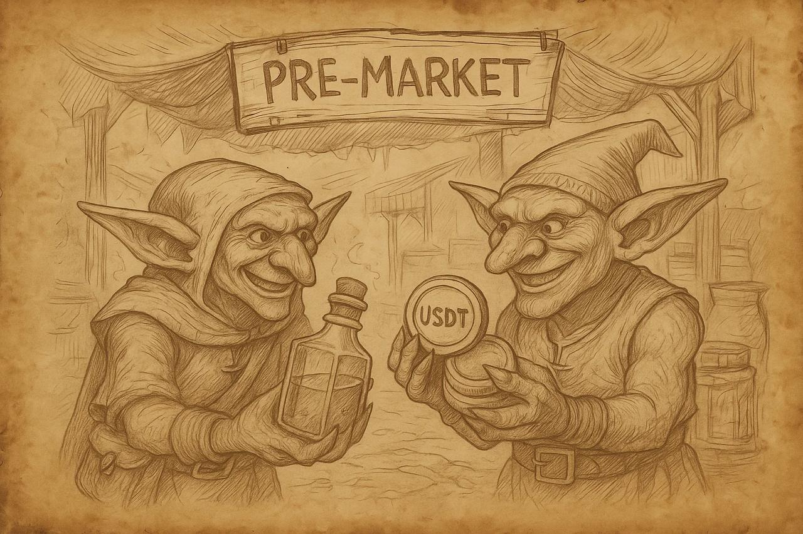

# Pre-Market and the Mechanics of the Alchemical Strategy

Greetings, Alchemists!

We are confidently moving toward the main event for all of us — the release of the game. As we have mentioned many times before, our game will feature an open, functioning economy and, in our view, will become the first true DeFi game. It will take the form of a gamified DEX exchange. With this approach, we aim to achieve one of the main goals of Magic Alchemy — to create a simple, intuitive, and accessible onboarding path for people who are just beginning to explore blockchain and the world of decentralized finance.

That’s why the next important step in building this ecosystem is the launch of the **POTION** token pre-market before the game release. We want to give our players the opportunity to take their first steps in trading and learn the basic principles of how exchanges work.

## The Pre-Market – Your First Alchemical Experiment in Trading
Our pre-market will function only until the TGE (Token Generation Event) and will operate as a derivatives market. Let’s break down this financial term.

***A derivative** is a financial contract that determines the future price of a cryptocurrency, security, commodity, or service. The subject of such a contract is called the underlying asset. Buyers and sellers of derivatives don’t own the underlying asset — they trade the right to execute the contract.*

In our case, the underlying asset will be the POTION token, and the contract is the right to transfer the POTION token from seller to buyer. On the Pre-Market, sellers and buyers will be able to trade ownership rights only to those POTION tokens that they received for participating in the NFT Marathon, and which will become available at the game’s release (TGE).

Trading on the pre-market will be conducted in USDT. Players will need to make a deposit into a special smart contract. The mechanics will be identical to the “Rusk Bank” system.

## The Process of Buying and Selling
Let’s see how the process of buying or selling POTION tokens on our pre-market will work.

Suppose a player wants to buy POTION tokens for 200 USDT. They will make a deposit from their game wallet to a special smart contract (the pre-market balance). Then, through the pre-market interface, they will create a buy offer, indicating the number of tokens and the price per token.

These 200 USDT can be withdrawn back to their wallet at any time **except when the funds are locked in a buy offer**. In that case, the amount will remain blocked until the offer is executed or canceled.

⚠️ **Important**: An offer is executed only if the seller agrees to transfer the entire number of tokens specified in it. Partial execution is not possible.
 One offer = one seller = the full number of tokens.

The same mechanics apply to selling. The seller creates a sell offer, specifying the number of POTION tokens and the desired price. Once the offer is created, those POTION tokens are locked in the pre-market balance until the offer is executed or canceled.

All trades on the pre-market are executed instantly and cannot be reversed once completed  **so make trading decisions carefully**.

**Example**:
Onotoliy creates a buy offer worth 200 USDT, setting the price at 0.2 USDT per token, meaning he can buy 1,000 $POTION for 200 USDT.
 Player SLAVAN accepts the offer and sells their 1,000 $POTION. The locked 200 USDT from Onotoliy are transferred to SLAVAN (minus the fee), and the right to receive 1,000 $POTION at TGE goes to Onotoliy.
 
On the main dashboard, Onotoliy will see an updated balance showing how many tokens he will receive at TGE.

All trades are recorded, and only at TGE will all POTION tokens automatically transfer to their new owners.

💡 **Remember**: this is a derivatives market. Sellers receive their USDT immediately, while buyers receive only the right to ownership of the tokens, which they can claim after TGE.

Pre-Market Dashboard. In addition to creating buy/sell offers, players will be able to:
* View their transaction history,
* See the average token price,
* Track the POTION token price chart over time.

Essentially, players will get nearly all the core functionality found on major DEX exchanges.

In the first part of this article, we deliberately didn’t mention the pre-market commission; it will be 10% per trade, deducted at execution.
This commission will be crucial for implementing the Alchemical Strategy.

## The Alchemical Strategy
This mechanic recently emerged in the crypto world and has already proven its effectiveness. You may have heard of it as the PUNK Strategy or NFT Strategy.
 In short, it works like this:
 
   Collect trading fees → buy back NFTs → resell them at a higher price → burn tokens using the proceeds.
 
Let’s break down how our Alchemical Strategy will work in detail.

1) A seller on our pre-market receives USDT minus 10%, and the buyer receives all purchased POTION.

**Example**:
 A player sells 100 POTION at $0.5 each, creating a sell offer. Another player buys those tokens for $50.
 The buyer receives 100 POTION, while the seller gets $45.
 
 2) The remaining 10% fee ($5) in USDT goes to a special wallet #1.

From this fee:
20% goes to the War Chest,
80% remains in wallet #1 to be used for buying Alchemists (NFTs) from the market.

3) Alchemists are bought once per day at floor price using all available USDT. Any leftover USDT rolls over to the next day.

Purchased Alchemists are transferred to wallet #2 and then listed 20% higher than their purchase price.

4) If players buy these Alchemists listed by wallet #2, all proceeds go toward buying and burning POTION tokens from the pre-market.
 Thus, wallet #2 gradually accumulates POTION for burning after TGE.
 
In some cases, wallet #1 may buy back Alchemists listed by wallet #2 the process works the same way.

On the pre-market dashboard, we’ll include a progress bar showing:
* The total commissions collected,
* The number of Alchemists purchased,
* The number of Alchemists sold,
* The total number of burned (wallet #2) POTION tokens.

This mechanic benefits **all participants**:

* **NFT Alchemist holders** – they’ll always have liquidity and can sell their NFTs at floor price.
* **POTION token holders** – a portion of the total token supply will be burned after the game’s release, which should positively influence POTION’s value.

At first glance, the 10% pre-market commission might seem high for sellers but we believe all market participants will ultimately benefit from the **Alchemical Strategy**.

We are confident that implementing such advanced mechanics — inspired by the latest innovations in the crypto space — makes our game stronger, more sustainable, and more attractive to new players.

May the blessing of Mendelef be with us all…
