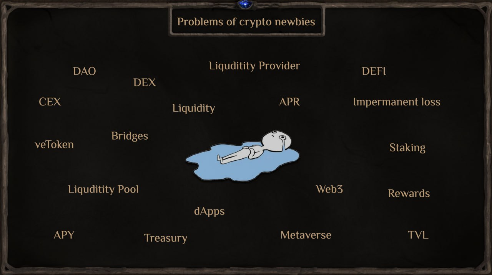

# Challenges of Web3 Tokenomics
The crypto industry continues to grow, but there are still significant challenges that must be addressed before cryptocurrency becomes an integral part of everyday life.

### Key Issues
🔹 New User Challenges – Beginners need guidance to navigate decentralized exchanges (DEXs).

🔹 Complexity of Game Mechanics – Traditional games already have intricate mechanics, and adding DeFi processes only increases the difficulty for players.

🔹 Pump & Dump Tokenomics – Unsustainable token models cause volatility and market manipulation.

🔹 Short Lifespan of Projects – Many projects collapse quickly, causing major financial losses for early users.

🔹 Weak Resistance to Mass Withdrawals – A lack of stabilization mechanisms makes ecosystems fragile.

🔹 No Barriers Against Mass Selling – Without controlled liquidity mechanisms, token dumping can cripple a project.

🔹 No Fund Accumulation Stabilization – Without a structured warchest, projects struggle to maintain financial health.

🔹 Lack of Dynamic Deflationary Mechanisms – Most GameFi projects fail to regulate token inflation.

🔹 Transparency Issues – Many projects lack honest and open financial management.

🔹 Early Exit Scams – Teams and early investors often cash out quickly, leaving users with worthless assets.

🔹 No Decentralized Reserve Fund (Warchest) – Without multiple revenue sources and DAO oversight, warchests are mismanaged or nonexistent.

### How Magic Alchemy Solves These Problems
✔️ A proprietary DEX to avoid dependence on external platforms.

✔️ Simplified liquidity management with a one-click system.

✔️ Direct fiat-to-wallet transactions, eliminating entry barriers.

✔️ Replacing crypto jargon with familiar gaming terminology.

✔️ A game-first approach, ensuring a natural experience without DeFi confusion.

✔️ A true Play-and-Earn model, where fun and engagement come before financial incentives.

✔️ A rich, dark fantasy world and immersive lore, making Magic Alchemy stand out from generic crypto games.

✔️ Strategies for time-limited players, allowing casual engagement without losing progression.

### Challenges in GameFi

At this stage of **GameFi’s evolution**, most crypto games rely on Play-to-Earn (P2E) mechanics. However, in their current form, these systems focus more on “Earning” than actual gameplay, leading to low engagement and weak visual appeal.
🔹 Weak Tokenomics – Many games operate like Ponzi schemes, relying on new players for growth without offering real value after the economic cycle ends.

🔹 Lack of Trust in DeFi – High gas fees and skepticism toward blockchain finance discourage adoption.

🔹 High P2E Exploitation – Wealthy players can invest more, dominate leaderboards, and outpace others in progression.

### The Issue of Fairness in P2E
One of the biggest flaws in Play-to-Earn is that success often depends on wallet size rather than skill. Wealthy players have an unfair advantage, making it difficult for low-investment players to compete.

A **truly sustainable GameFi model** must prioritize balanced gameplay, ensuring that economic benefits don’t overshadow the core gaming experience.

