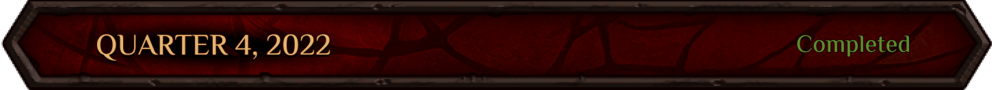
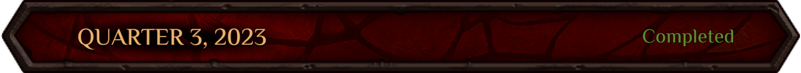
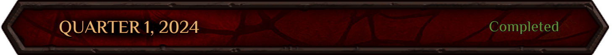
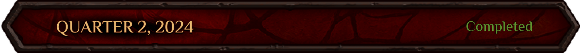
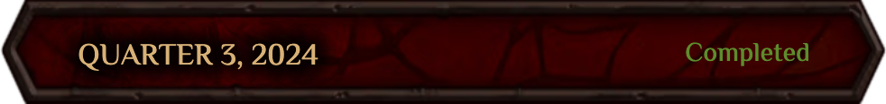
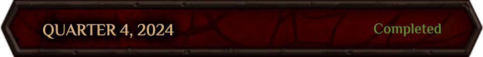
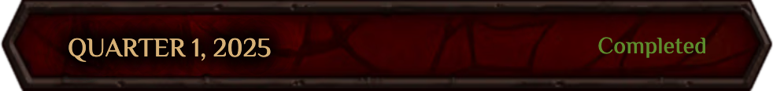
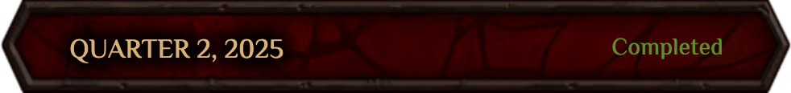
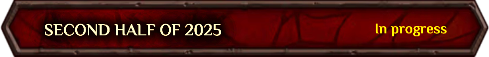

# Roadmap Magic Alchemy

- Формирование команды
- Разработка и обсуждение идеи игры
- Начало работы над документом по игровому дизайну (GDD)
- Проработка концепции NFT-алхимиков
- Разработка концепции базовых игровых механик
- Исследование существующих блокчейнов, выбор стека для разработки смарт-контрактов
- Принятие концепции архитектуры токеномики
- Разработка концепции сеттинга игрового мира

- Первичная реализация DeFi-протокола Magic Alchemy
- Создание wireframe-локаций с DeFi-механиками 
- Реализация карточной игры в качестве дополнительного игрового контента 
- Отрисовка персонажей-алхимиков, коллекций колб и игральных карт 
- Разработка локаций и их рендеринг 
- Создание логотипа проекта 
- Проработка игровых механик для ограничения «абуза»
- Создание карты и описания стран мира Джи’Да 
- Написание Легендариума мира Джи’Да

- Реализация фронтенда для DeFi
- Разработка и отрисовка локаций
- Создание UI игры, построение локаций
- Дизайн NFT-коллекции и внутриигровых активов
- Моделирование токеномики
- Внедрение дополнительных NFT-предметов для лаборатории
- Баланс прогрессии персонажей
- Разработка маркетинговых активностей перед запуском игры
- Описание структуры общества гоблинов и их племён
- Подготовка лор-квестов для маркетинговой фазы

- Производство видеоконтента
- Разработка UX/UI маркетплейса
- Моделирование и финализация токеномики
- Разработка и реализация Free-to-Play сценария
- Тестовая реализация бэкенда и механизма авторизации
- Деплой и резервное копирование проекта
- Дизайн NFT-коллекций и внутриигровых активов
- Отрисовка артов для лора и маркетинга
- Реализация Free-mint: модификация и переработка маркетинговых квестов
- Лор-тексты, игровые персонажи и их биографии для Free-to-Play

- Расширение команды 
- Проектирование архитектуры бэкенда
- Декомпозиция проекта по направлениям разработки
- Работа над UX/UI внутриигровых локаций
- Проработка арта и интерфейса концепта NFT-аукциона
- Интенсивная работа над лором и маркетинговыми текстами
- Angel Round
- Финализация токеномики
- Дизайн и запуск веб-сайта
- Запуск дев-блога в Telegram
- Подготовка контента для соцсетей проекта
- NFT-коллекции и внутриигровые активы
- Разработка и отрисовка локаций
- Отрисовка артов для лора и маркетинга
- Расширение лора, подготовка текстов для описания игровых механик

- Реализация бэкенда карточной игры
- Рефакторинг архитектуры фронтенда
- Расширение команды разработки
- Работа над GDD
- Работа над UX/UI локаций и активностей
- Подготовка маркетингового плана
- Мониторинг и улучшение внутриигровой экономики
- Подготовка Whitepaper и Gitbook проекта
- Дизайн NFT-коллекции и внутриигровых активов
- Арт для карточной игры
- Отрисовка артов для видео
- Создание основной сюжетной линии игры
- Подготовка текстов для всех игровых квестов

- Внедрение и релиз фронтенда карточной игры
- Написание всех внутриигровых диалогов
- Создание биографий для игровых персонажей
- Финальная редактура всех литературных текстов

- Релиз ALPHA-версии карточной игры Magic Towers
- Mint коллекции NFT Mugs

- Первый карточный турнир
- Релиз BETA-версии карточной игры
- Запуск обмена кружек на первого игрового персонажа 
- Заключение маркетингового соглашения с платформами Gam3s.gg, EA, Карв
- Работа над новыми игровыми локациями для этапа RepairMan FreeMint
- Улучшение и ввод новых игровых механик. 
- Запуск "Колеса фортуны"
- Введение рейтинговой системы и достижений для игроков
- Работа над балансом карточной игры, введение новых карт, мулиган

- Релиз нового игрового этапа RepairMan FreeMint
- Организация второго крупного карточного турнира
- Улучшение и ввод новых игровых механик. Питомец, минт мастерских-повозок
- Проработка игровых локаций для следующего этапа "Вари или умри"
- Новый ребаланс карточной игры
- Открытие seed раунда, поиск и привлечение инвесторов
- Запуск нового игрового этапа "Вари или Умри"

- Работы по оптимизации МА на мобильных устройствах
- Разработка и запуск нового игрового этапа Alchemania
- Релиз Alchemania через miniapps в Telegram
- Запуск карточного турнира “Alchemania Cards Tournament”
- Старт амбассадорской и маркетинговой программы

- Введение сюжетной арки “Рунные квесты”
- Запуск мемкоина “Сухарики”
- Релиз нового игрового режима в Башни, введение платных игр на “Сухарики”
- Запуск карточного турнира с самым большим призовым фондом
- Запуск большого розыгрыша  в честь годовщины таверны Fallen Moon
- Публикация в открытый доступ токеномики игры Magic Alchemy

- Запуск минта солбаунд NFT
- Сторонний аудит и проверка смарт-контрактов
- Запуск эвента “Пророчество Глоба”

- Запуск главного игрового этапа “Марафон по продаже токенов и NFT”, это двойной  аукцион по продаже главных игровых персонажей  и игрового токена “POTION”
- Подведение итогов Большой лотереи в честь годовщины проекта
- Запуск этапа “Трансмутация колб” и “Вливание души”
- Выпуск второй лимитированной коллекции мерча от Magic Alchemy — “Elixir of Madness”
- Проведение первого DAO-голосования о размещении средств Варчеста в лендинговых-протоколах
- Ребаланс в карточной игре “Башни” и введение новой механики “Формула возврата”

- Запуск этапа “Первому алхимику приготовится”, этап по стейкингу алхимика для получения дополнительных наград в токене POTION
- Открытие внутриигрового маркетплейса NFT
- Запуск внутриигровой механики “Торговые караваны” и изготовления запчастей для алхимических бустеров
- Подведение итогов Вари или Умри, Alchemania. Распределение airdrop токенов.
- Релиз игры
