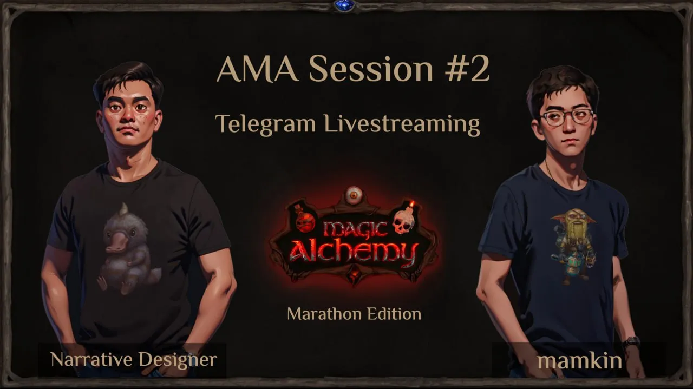

Second AMA Session — Magic Alchemy
==================================

Hello everyone! Here’s a summary of our second AMA session. For more detailed answers, check out the [**FULL VIDEO**](https://www.youtube.com/watch?v=brFu5px7MFU) on YouTube.

**00:15 — AMA Kickoff**  
The AMA began with introductions from the speakers: Magic Alchemy’s CEO Andrey, narrative designer Alexander, and marketer Geser. The session focused on the upcoming **Marathon**, the main public sale for tokens and NFTs. Topics included the mechanics of the Marathon, staking for alchemists, and the core DeFi elements in the game. The speakers highlighted the previously published Marathon article as an essential guide to understanding the mechanics and participation conditions.

**01:35 — Marathon Rules Overview**  
The Marathon is a dual auction distributing **500,000 tokens** and **4,200 flasks** containing embryos. Participants can place hourly bids on flasks of varying rarities (common, rare, epic, legendary). Token quantities and prices depend on hourly bids. For example, less competition means cheaper tokens. Players compete for both flasks and tokens, with the top 5 bids each hour guaranteed to win a legendary flask with an embryo.

**07:19 — Rewards for Participating in the Marathon**  
Participants receive additional rewards for bidding, such as **loot boxes**, **gems**, **essences**, and **points**. These rewards can be used in the game prior to its release, as a way to encourage and reward active players.

**08:13 — Public Sale Importance and Its Impact on Drops**  
The public sale is a key milestone before the game’s launch. Players supporting the project during this phase will gain additional benefits and recognition through exclusive drops.

**09:38 — Requirements for Infusing a Soul into an Epic Embryo**  
Creating an epic embryo requires **Ugly Broth**, obtainable from epic flasks. The likelihood of obtaining it depends on the number of participants and bids during a specific auction hour. Fewer participants increase the chance of receiving epic broth.

**11:06 — Determining Flask Contents: Embryos vs. Ugly Broth**  
A smart contract randomizer powered by **Chainlink** will decide flask contents. Legendary flasks always contain embryos, while other flasks have probabilities determined by type and total bids.

**12:31 — What Happens If There Are Fewer Than 100 Bids in an Hour?**  
For example, let’s imagine that only 90 bets were placed in a specific hour. Such a situation is unlikely. But if it happens, all unused flasks in this hour will be burned. The distribution will be roughly as follows: 90 participants will receive 5 legendary, 15 epic, 30 rare, and 40 Mendelef Common Flasks. 10 commmon flasks will be burned.

**13:26 — How Does the Team Plan to Attract New Active Players?**  
The focus is on **influencers and streamers**, both local and international. Collaborations, tournaments, and partnerships with DeFi communities are also planned. The **Alchemania** platform serves as a marketing tool.

**16:05 — Targeting Non-Russian Audiences for the Marathon**  
The team is actively working to engage international players, collaborating with agencies that specialize in global influencer outreach. The approach balances scaling efforts with meaningful engagement in localized communities.

**18:46 — Alchemist Bonuses and Rarity-Based Differences**

* **Legendary** and **epic** alchemists can create guilds, unlocking extra rewards.
* Rarer alchemists yield higher token returns in staking (legendary alchemists earn 10x more than commons).
* High-rarity alchemists have increased stamina, allowing them to farm longer without penalties.
* Legendary alchemists receive **royalty shares from rake revenue** in paid games.

**21:11 — Legendary Alchemists and Rake Royalties**  
A portion of the rake from paid games will go to legendary alchemist holders, with the rest going to the project treasury. This provides an incentive for owning legendary characters.

**21:50 — How to Buy POTION Tokens After the Marathon**  
Following the Marathon, a **liquidity pool** will be created based on collected funds and the average token price during the sale. Tokens can be freely traded in this pool, with prices determined by demand and Marathon results.

**24:50 — Metrics for Evaluating the Marathon’s Success**  
Success will be measured by **funds raised**, **player engagement**, and **liquidity generated**. For investors, metrics like TVL (Total Value Locked) and user activity are key. For the team, success also includes maintaining the project’s reputation and ensuring long-term economic stability.

**27:51 — Commitment to the Project if the Marathon Underperforms**  
The team is fully committed to the project’s longevity. The founder emphasized that even in the case of low funds, the project will not be abandoned. For the studio, this is a reputational endeavor as much as a financial one.

**30:42 — Expected Drop Date**  
The drop is scheduled for **Q4 of this year**, with a potential delay of a few weeks depending on the Marathon’s completion and game readiness.

**32:04 — New Ingredients Post-Release**  
Ten new zones with unique ingredients will be added, including plants, metals, and minerals. Players can explore these zones to gather resources.

**33:38 — Earning Opportunities in the Game**  
Players can earn through:

* Buying tokens and flasks at lower costs during the Marathon.
* Selling surplus NFTs and tokens after the Marathon.
* Competing in **leaderboards**.
* Utilizing **free-to-play mechanics** to craft and trade items.

**36:01 — Growing Alchemists**  
In the game’s lore, alchemists are goblins created in test tubes. Players will use flasks for **transmutation**, adding souls via Ugly Broth to bring alchemists to life.

**38:43 — Future Utility of Goblin NFTs and Wagons**  
NFTs will remain an important part of the game. After the game is over, the season rewards sewn into it in the form of POTION tokens can be pulled out of the alchemist. And the NFT itself will indicate in the metadata whether or not it has POTION tokens in it. Mechanics for cross-platform use of the NFT in the studio’s future games are also being developed.

**41:14 — Mana Crystal Uses in the Game**  
Mana crystals upgrade alchemical machines and earn leaderboard points. They will also feature in future mechanics tied to tool enhancements.

**42:08 — Project Treasury Formation and Game Monetization**  
Revenue sources include:

* DEX fees.
* NFT tool and booster sales.
* Paid games and rake revenue.  
  The treasury is distributed via DAO mechanisms and supports token stability.

**46:14 — Alchemist Rarity and Game Progression**  
Alchemist rarity does not affect story progression speed but offers economic advantages, such as higher token farming rates.

**47:22 — Flask Purchases During the Marathon**  
Flasks can be purchased with the main wallet. Custodial wallet gas fees are covered by the project, while MetaMask wallets require POL tokens for gas.

**48:52 — Alchemist Limits Per Wallet**  
Players can link one alchemist to their account, but wallets can store unlimited NFTs. A future rental system for alchemists is planned.

**54:18 — Guaranteeing Specific Elements for Mendeleev’s Table**  
The team declined to share details but assured players that active participants can complete their tables.

**54:54 — Game Characters and Playable Races**  
While goblin alchemists are the main characters, other races like elves, orcs, and humans will appear in the story but won’t be playable.

**56:10 — Will the Game DEX Support Any Token Pairing?**  
The DEX will be limited to in-game tokens. Adding external token pairs is not currently planned.

**58:14 — Liquidity Pool Version**  
The game uses liquidity pools similar to Uniswap V2 for simplicity, avoiding concentrated liquidity mechanics.

**59:25 — Handling Identical Marathon Bids**  
The winner is the one who placed the higher bid first. For example, Player 1 placed $10 in the first minute of the hour, while Player 2 placed $90 midway through the hour. At the end of the hour, Player 1 added $90, and Player 2 added $10. Although both players have a total bid of $100, Player 2 wins because they were the first to place the higher bid.

**59:40 — Wallet Funding Guide**  
In-game instructions guide players on funding their wallets. Recommendations for using exchanges like Binance and Bybit are also provided.

**1:00:35 — Managing Excess Epic Ugly Broth**  
Excess broth can be used in future mechanics involving mystery boxes and randomized rewards.

**1:02:12 — Embryo Shortages and Alchemist Pairing**  
If demand spikes, new base-level alchemists will be introduced via auctions. There are no pairing mechanics for alchemists.

**1:08:01 — Can Experience Be Transferred Between Alchemists?**  
Experience transfer between alchemists is not allowed. Each alchemist levels up individually.

**1:09:18 — Game Mechanics After the Marathon**  
Post-Marathon, key DeFi mechanics like **transmutation** and **staking** will be introduced.

**1:12:38 — Crypto Market Conditions and Game Launch**  
The launch timing depends on favorable market conditions to minimize risks.

**1:17:23 — Priority for Legendary Alchemists with Identical Bids**  
Priority is given to the player who placed the highest bid first.

**1:22:56 — Season Rewards Locked Until End of Game**  
Season rewards will remain locked but can be sold with the associated alchemist.

**1:24:20 — Upcoming Card Tournament Before the Marathon**  
Two tournaments are planned: one for influencers and one for players. They will have shorter durations.

**1:25:10 — Market Downturns and Game Launch Timing**  
The launch may be adjusted based on market conditions, but the team aims to stick to the schedule.

**1:27:03 — Bid Timing Priority for Flask Rewards**  
In the case of equal bids, priority is given to the player who placed the higher initial bid during that hour.

**1:29:20 — Audit Before the Marathon**  
The Marathon will undergo an audit, with additional checks planned for more complex DeFi mechanics.

**1:31:10 — Switching MetaMask Wallets in the Game**  
Currently, wallets cannot be switched, but the team is working on this for the future.

**1:33:34 — Closing Remarks**  
The team wrapped up the AMA, emphasizing the importance of the article on game mechanics. Participants were encouraged to review the material and prepare for the Marathon.

**1:35:20 — Importance of the Token and Alchemist**  
The token underpins the game economy, being integral to most mechanics. The alchemist is a central character, essential for participating in paid games.
