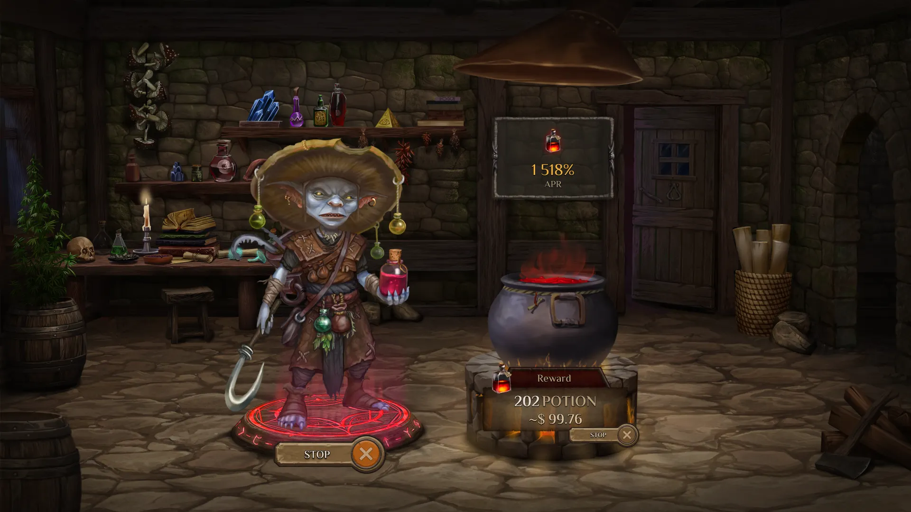
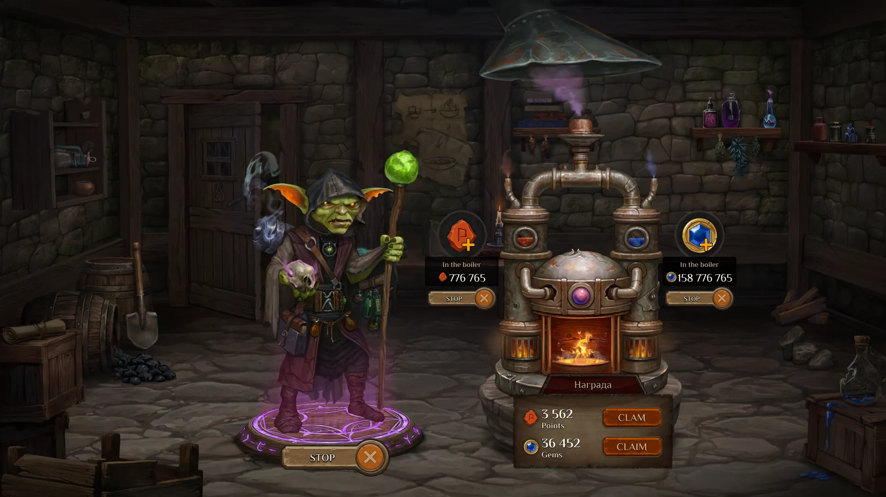
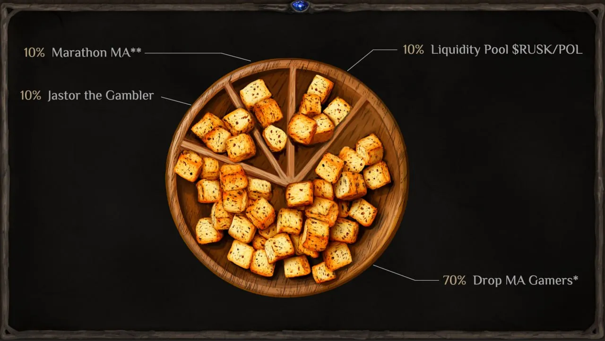
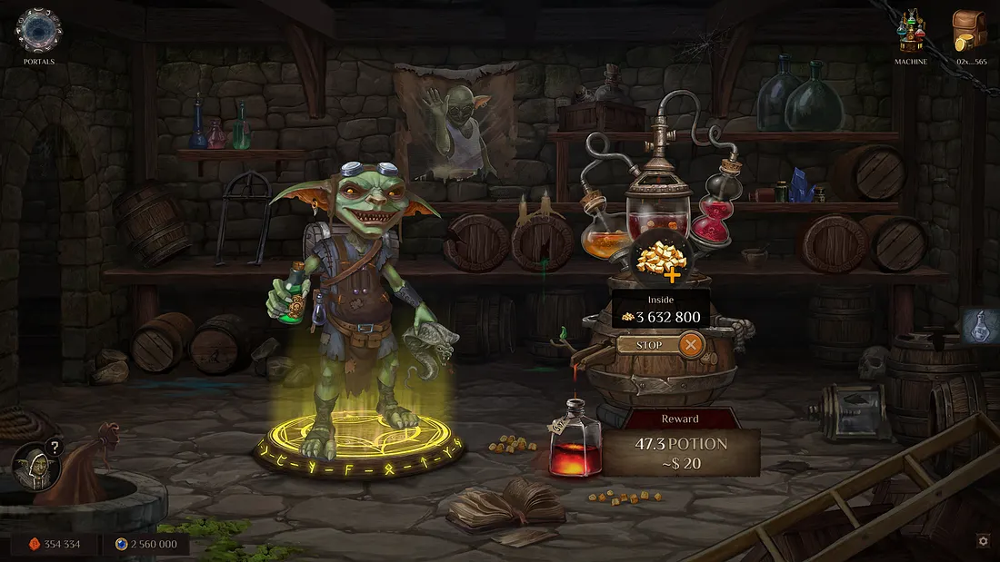

# The new mechanics of staking $RUSK.

Welcome, Alchemists!

In this article, we want to reveal all the new game mechanics that will take place during the “Ready Alchemist One” stage. As you know from [the article](../pap_2/pap_en.md) about the stages following the NFT and POTION token Marathon, this stage will begin after the “Flask Transmutation” and “Soul Infusion” phases. By that time, players will already have NFT Alchemists in their hands, and all activities will take place in the game location known as the “Workshop.”

The Workshop will feature two new sub-locations: the Small Workshop and the Experimental Lab, each with its own unique game mechanics.

In the Workshop, players will need to stake their NFT Alchemist. Throughout the duration of “Ready Alchemist One” players will receive rewards in the form of POTION tokens. All information about the amount of POTION received by the player will be recorded in the NFT Alchemist’s metadata.

In the Small Workshop, players with an NFT Alchemist can stake it and, by adding Gems and Points to the Alchemical Generator, start earning additional Gems and Points. Players who take advantage of this mechanic will significantly improve their standing on the Alchemania and Brew or Die leaderboards.

Meanwhile, in the Experimental Lab, players will have the opportunity to stake their meme-tokens, $RUSK.

## Our Community Meme-Token $RUSK
When we launched our [meme-token $RUSK](../tokenomics_rusk/tokenomics_rusk_en.md) in November, we immediately stated that it was a way to reward our warm community for their support and belief in our game. “Rusk” is a people’s meme, and here’s why:

1. **Most of the tokens are in the community’s hands**. We immediately distributed 70% of the rusks and will distribute another 10% during the Marathon. An additional 10% of the emission was allocated to the liquidity pool along with a 10k POL grant received from POLYGON. This way, we decided to give our grant back to our community.

The remaining 10% is held by Justor for tournament prizes or other marketing activities.

2. **The ‘Rusk’ meme originated from our warm chat** as a response to the constant messages of “When drop?” Our close-knit gaming community created this meme-token and contributed to our decision to launch paid card games using rusks.

3. **All meme-token $RUSK holders are our community**. We’ve often said that everything rests on your shoulders, and with the launch of rusks, we truly felt that support. 70% of players did not sell their drop, and many even bought more — without knowing the token’s future, without promises of utility or integration into the game. We’ve never seen anything like this in Web3 games before, and we have every right to believe that we have a unique and powerful community.

Here, we’d like to quote our CEO, Mamkina:

*“I think too many Web3 companies don’t understand that their main asset is the community. Too many believe that their main asset is the funds behind the project, the amount raised from VCs, listings on major CEXs, Twitter score, and influencers who manipulate the crowd and sell through second-hand orders. For them, the community is always just exit liquidity, a market into which they can dump their bags. We see things a bit differently.*

*A meme is the tokenization of a community. It is the digitized value of each individual within the ‘tribe’ or ‘pack’ — only in the modern digital society of the 21st century. Just as the Federal Reserve prints dollars, you have created new private money and given it value. You’ve ignited a primordial fire, but it’s not just money; it’s fun, it’s belonging to the Magic Alchemy community. We all want to be part of something bigger, to experience joy and emotions without manipulation and toxicity.”*

For this reason, we have once again decided to reward our wonderful gaming community. **From now on, all holders of the meme-token $RUSK will receive tokens from all our future gaming and non-gaming projects**. How do you like that, Elon Musk?

## New Game Mechanic: $RUSK Staking {#rusk-staking}
In the new Experimental Lab sub-location, players who own an NFT Alchemist must stake it along with their meme-tokens $RUSK in the Magical Transformer. In return, they will receive POTION tokens from the DAO reward pool. All these rewards will also be recorded in the metadata of the NFT Alchemist staked in the Experimental Shop.

The reward pool for staking the meme-token $RUSK is 320,000 POTION. These tokens belong to the DAO and can only be used after the game ends. The staking process will continue even after the game’s launch.

The only limitation is the maximum number of rusks that can be staked per wallet — 1 million $RUSK meme-tokens. This restriction ensures that large rusk holders do not have an overwhelming advantage over other meme-token holders.

## Summary
With these new game mechanics, players will have the ability to decide how to best utilize their Alchemist:

- Stake it to receive POTION tokens, which can only be used after the game ends.
- Increase the number of Gems and Points, thereby boosting their chances of securing a larger share of the airdrop available immediately after the game’s release.
- Stake their meme-tokens $RUSK to earn additional POTION tokens.
- 
As you know, we have always strived to bring something new and innovative to our game. From the core idea of representing a DEX liquidity pool as a magical cauldron brewing two potions to the uniquely structured NFT auction and public token sale. Now, by introducing new game mechanics and tools, we aim to prove that we are capable of creating what we believe to be the first truly functional DeFi game.

That’s why we invite you to witness this event! Join the Marathon and become part of this unique phenomenon.

May the blessings of Tara Mendelef be with you! 🔮✨

## FAQ
**What is the reward distribution mechanism for staking $RUSK?**

Rewards are distributed in the classic DeFi model: the larger your share of the total rusk staking pool, the greater your share of the rewards. For example, if you are the first to stake rusks in our reward pool and 200 POTION is distributed per hour, you will receive all the rewards while you are the only participant. Once a second player joins, the rewards are split between both of you.

**If I have three Alchemists in my wallet, can I stake them all?**

Yes, and this would be the most logical decision to take full advantage of all the opportunities provided during the “Prepare the First Alchemist” stage.

**What if many players stake their Alchemist and $RUSK? Will they claim the entire 200,000 POTION reward pool within a month?**

No, because the reward pool will be distributed over the entire staking period. Each month, a strictly defined amount of POTION will be allocated. We will announce the exact details later.

**Does the rarity of the Alchemist affect the rewards when staking in the Experimental Lab?**

No, the rarity of the Alchemist does not impact the rewards. The number of rewards depends solely on how many rusks you add to the Magic Transformer and their share in the total POTION distribution pool.

**What if I have more than 1 million $RUSK?**

Since we have introduced a staking limit per wallet, the only option is to transfer the excess rusks to another wallet, such as one belonging to your spouse or a friend. There, as long as an Alchemist is present, the rusks can also be staked.