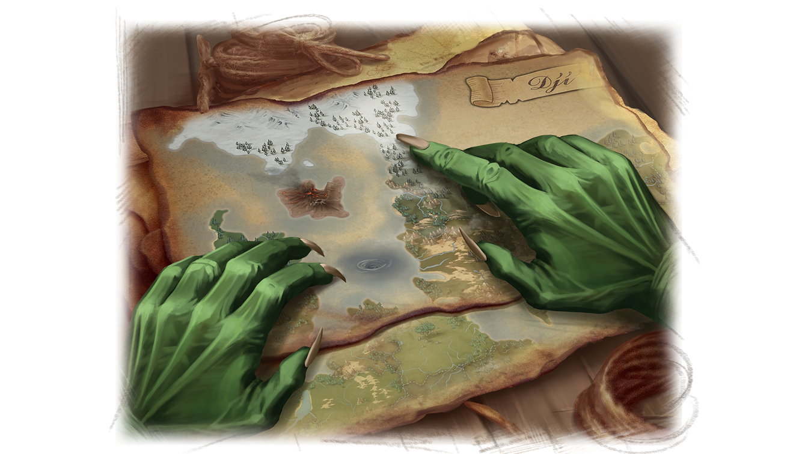
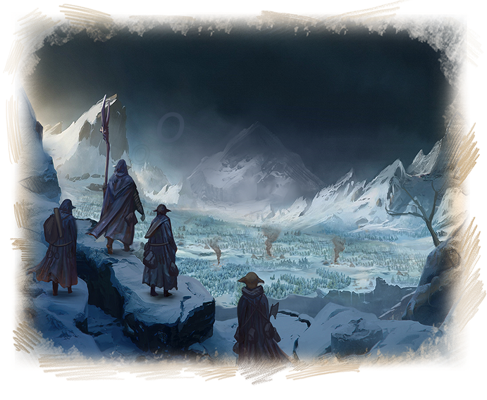
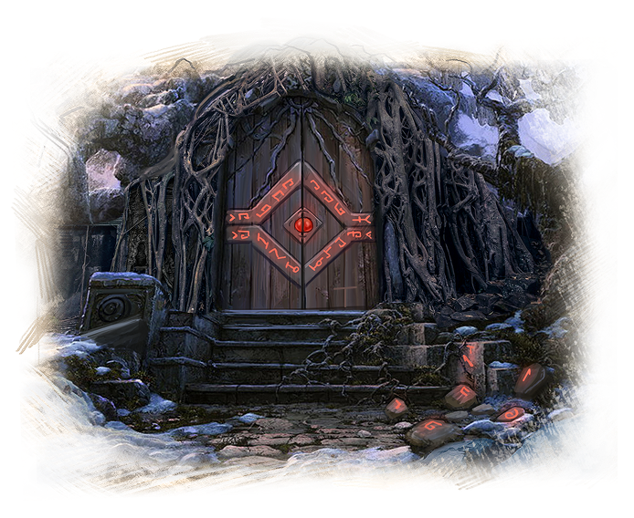
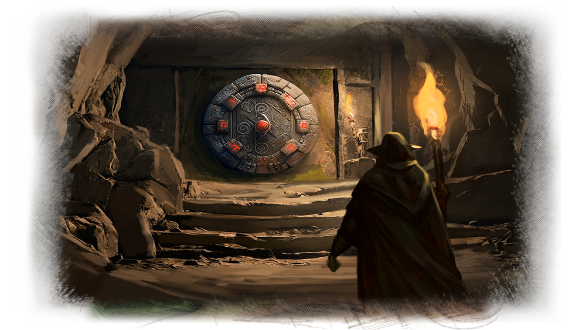
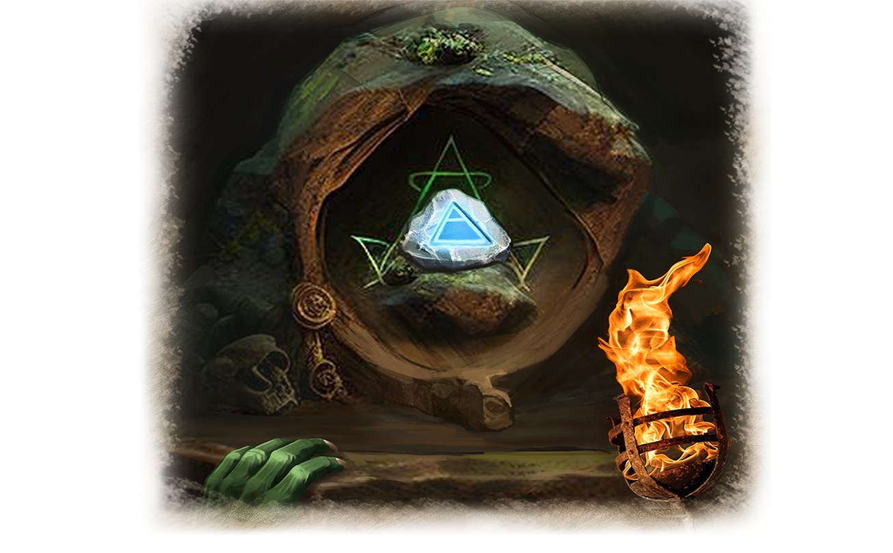

 #  Северные земли

Горл тяжело переводил дыхание. Рана на груди снова начала болеть - нужно поменять повязку как можно скорее.

Эликсир жизни, который мог бы мгновенно вылечить ранение, остался в сумке, а ее и другие вещи пришлось бросить, когда Горла настигли орки.

«Надо было его переложить в поясной кошель. Слава Мендельфу, мне удалось отделаться лишь раной на груди, – подумал Горл. – Будь рука того орка точнее, я уже лежал бы с перерезанным горлом».

«С другой стороны, хорошо, что в кошеле был эликсир выносливости, и я смог оторваться от погони благодаря ему. Нужно скорее дойти до границ Северных гор, там уже должны быть сторожевые крепости гномов», – продолжал размышлять Горл, устраиваясь на ночлег в дупле гигантской сосны.

Поменяв повязку, Горл начал прокручивать в голове события, которые привели его к смертельной опасности. К тому, что он оказался совершенно один, да еще и в землях, где хозяйничают орки. 

Все началось два месяца назад, когда Горл отправился в рискованную экспедицию на территорию Северной Орды. Он должен был проверить место, в котором, возможно, находился храм Менделефа. На это место указывала недавно найденная древняя карта.

Горлу в проводники дали трех опытных гоблинов-следопытов из племени Одинокой Луны. Они лучше всех знали эти северные края и могли провести его невредимым по этим опасным землям. 

Двадцать дней гоблины пробирались по диким тропам северных краев. Благодаря навыкам следопытов и передвижению по ночам, их небольшой группе удавалось незаметно миновать орков, иногда встречающихся на пути. 

Наконец, они достигли цели и вышли к останкам каменных строений, покрытых буйной растительностью. Внутри руин гоблины обнаружили множество следов и старые кострища, которые оставили орки. Видимо, иногда они сюда забредали, когда охотились.

Разбив лагерь, гоблины приступили к исследованию руин. Горл определил, что это Храм Менделефа, ведь сохранившиеся характерные барельефы явно указывали на это. 

Осматривая внутреннее пространство храма, Горл обнаружил скрытый тайник в месте, где возвышался алтарь. Ему потребовалось решить головоломку, чтоб его открыть. 

В открывшемся тайнике гоблин нашел древний свиток и металлическую пластину с изображением Символа Воздуха. Горл сразу узнал пластину, ведь подобную этой он получил в Дорнкуне от Свена Торвальсона.

Забрав найденное, гоблины отправились в обратную дорогу на следующий день. Отряд прошел уже половину пути, когда на них из засады напали орки.

Гоблины из племени Одинокой Луны решили остаться и задержать орков, давая возможность Горлу вырваться из ловушки. Он должен был во что бы то ни стало доставить артефакт и свиток старейшинам Ордена.

И вот после всех этих тревожных событий Горл находился в сутках пути от границ спасительных Северных гор…

