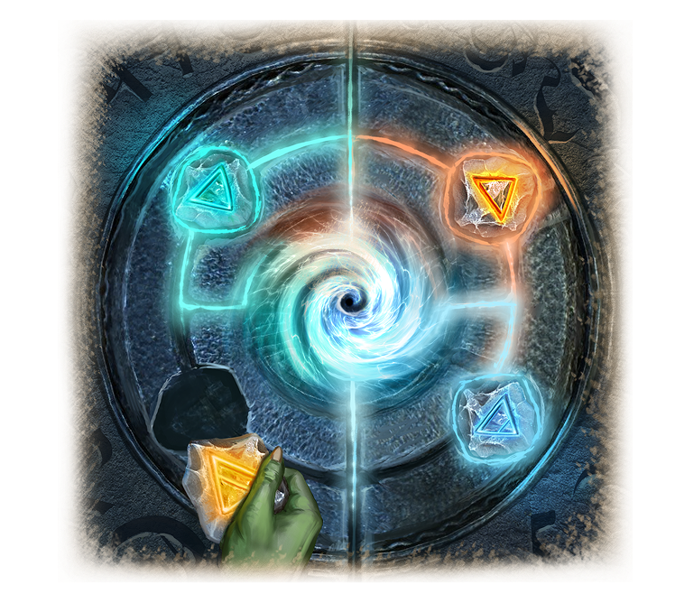

# The Gates of Mendelef

A vast metal gate towered over the Seeker Squad. From Mendelef's magic emanating from them, all the goblins nearby felt a slight tingling sensation all over their bodies. This gate has been hidden in the depths of the Castle Mountains for millennia.

The gate was discovered thanks to an ancient map that Gorl obtained in the lands of the Northern Horde more than twenty years ago. Many years and a lot of effort have been put into finding the cave passages, but only recently has a search party succeeded in achieving its goal.

Gorl, along with other members of the Council, arrived at the site as soon as the Order received word that the gate had been found. 

The scouts' attempts to open them were unsuccessful, and Gorl was not even surprised to hear about it. He guessed that only the Runes of the Elements could unlock them, so all the plates were brought here.

Gorl, at the head of a group of elders, approached the gate. He was finally able to examine them in detail up close. The gatefronts were richly decorated with patterns and bas-reliefs depicting Mendelef and the first goblins.

Four cavities were in the center of the gate, where the flaps closed. Above each was a Symbol of the Elements: Fire, Water, Earth, and Air. Gorl excitedly pulled out the plates and inserted them into the recesses one by one. 

A green light began to spread across the gate leafs. A rumble filled the vaults of the cave, and the gates slowly began to open.

All the goblins saw a tunnel into the cave's depths, with light seemingly pouring out of its walls.

Gorl scratched his scar involuntarily, looked around at his brothers, and stepped forward into the unknown...
