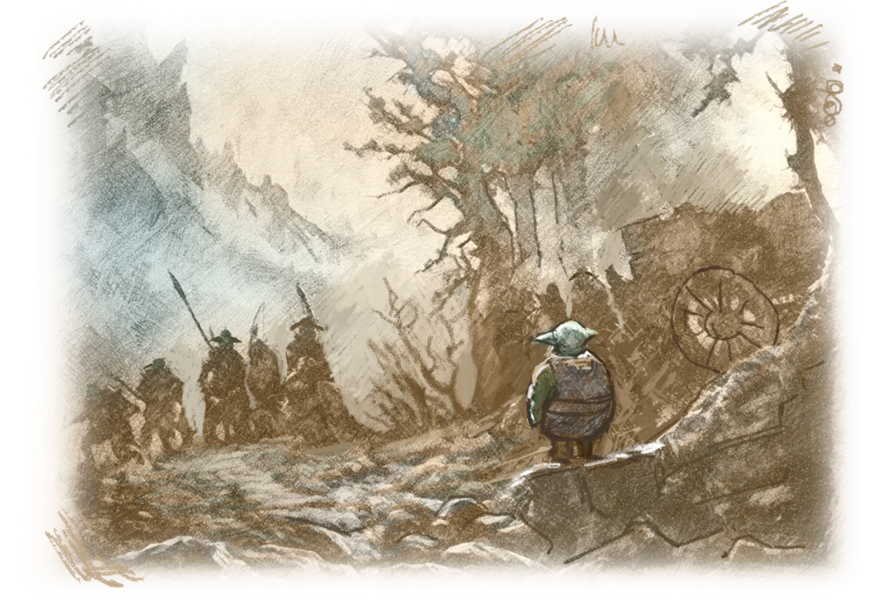
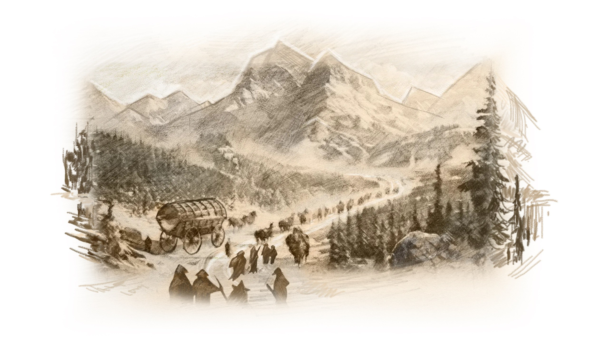
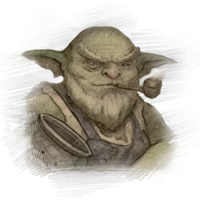
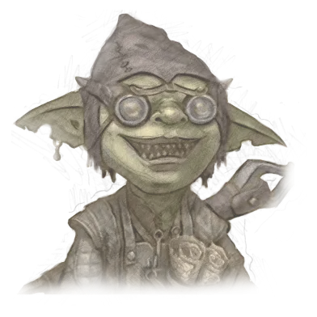

# Homecoming

The winter sun was slowly rising from behind the snow-capped peaks of the Castle Mountains. The next day, goblins from the Zuun Mercat tribe began their great journey.

Ulzar helped his father put things in the wagon and prepare it for the road. The night goblin camp was already filled with noise and clamor. Hundreds of riders were harnessing yaks and horses and lining up the wagons in marching order, according to their prearranged places in the column.  

The young darhan stopped briefly to look again at the mountain peaks already visible in the distance. The journey's final destination was near and waiting for them deep within the Castle Mountains. The hidden valley of Echoron, the ancient home of all goblins, had finally been found.  

This event shocked all the children of Mendelef without exception. The prophecy, which many goblins thought was a legend or myth, turned out to be true. 

The news of finding the ancient homeland echoed joy in the hearts of every goblin, but everyone was anxious because the prophecy told of terrible events that would soon fall on the whole world. 

*Father, I remember you said that these parts were unsafe and that even large trade caravans had been attacked by bandits. Can we travel out in the open like this? - Ulzar asked, folding the tent.* 

*Ulzar, you're a smart lad, aren't you? Who would attack us when our whole tribe is here? A buhlag of Sentinels accompanies us, - Dazar said, checking Coaly's harness.* 

As Dazar's words were confirmed, a troop of goblins on foot suddenly emerged from the forest and approached the head of the column. The Sentinel scouts had come to report that there was no danger to the settlers ahead.

 
The brigands fishing in these parts had experienced firsthand what happens when a poisoned goblin dart hits a human's body. So they left the area as soon as possible. 

It wasn't long before the vast column began its journey to the foot of the mountains. Hundreds of wagons and carts rolled slowly across the frozen ground of the kingdom of Erteland. 

And while the bright and colored wagons of the Zuun Mercat tribe traders were already familiar in the kingdom, the sight of the others aroused great curiosity in anyone who saw them for the first time.   

Massive wagons of the Pickers' buhlag could be mistaken for barns on wheels from afar. They were used to store provisions, seedlings, and plants for the newfound homeland. These included ordinary vegetables and grains and rare, unique plants needed for alchemical potions and elixirs.

The Alchemists' wagons were majestic and decorated with a fanciful ligature of magical symbols, and their stovepipes were often bursting with multicolored sparks. Even on the road, they kept brewing magic potions.  

Every goblin, even a child, knew the omen and that if an alchemist were brewing a potion, there would always be a darhan nearby. And so it was here. Among the many artisans' wagons, the workshops of the darhans stood out brightly.

Master Dazar's wagon led the group of traveling workshops. He was famous among all the goblin tribes, and no one was surprised that his wagon led the Artisan's buhlag.  
 

*Father, is it true what they say that all the tribes of our people must unite again? - Ulzar asked, climbing onto the foot of the wagon.* 

*It's true. I know that the Vala'as Hina have already left Ancoran. They will arrive second to us in Echoron. There is also news that the Lonely Moon and the Forest Goblins are coming. But they will not be here soon, for they have to sail from Farnax, another continent.* 

*Now, alchemists of all tribes are hurrying to the valley of Echoron, where the truth of the words of prophecy was discovered and the abode of our father, Tara Mendelef, which holds the knowledge and wisdom of the first great alchemists, was found. So be ready. You and I will have more work to do soon. All the darhans will have more work to do, - Dazar said, filling his pipe. Then the master smith called to Coaly, his yak, urging him on.*

 

The darhan's wagon moved slowly forward. The caravan of Zuun Merkat settlers continued its journey towards the mountains in the distance.
