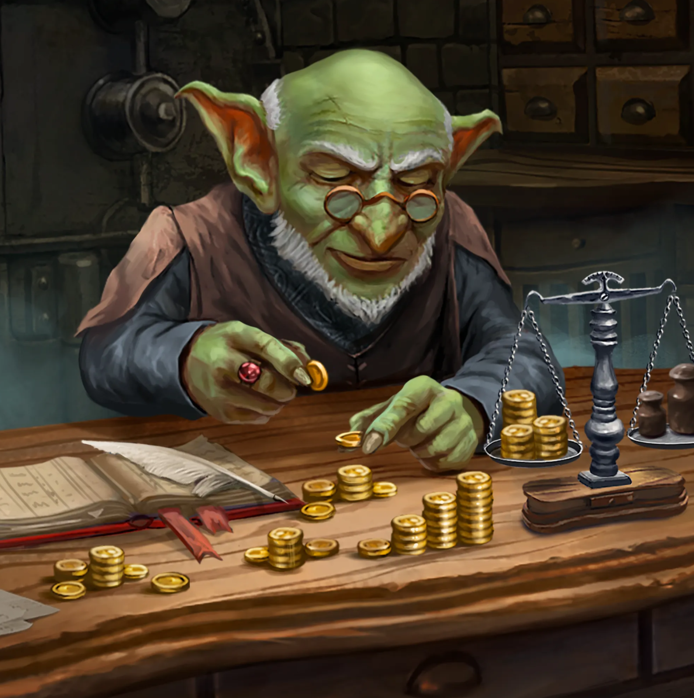
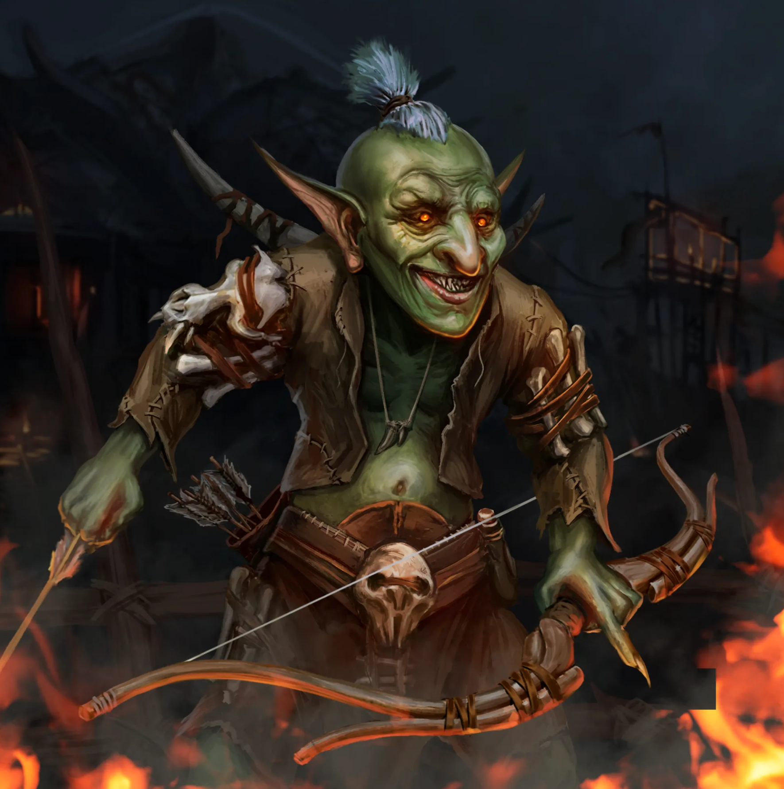
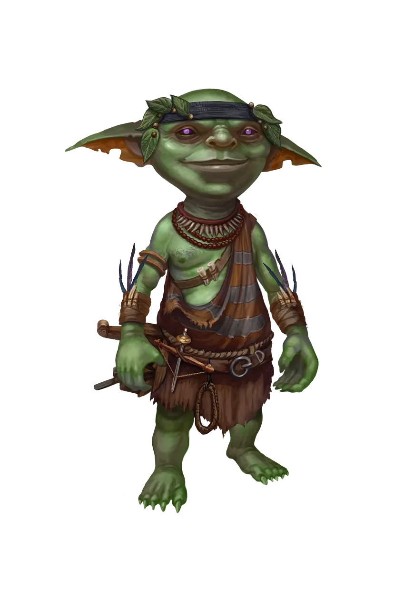
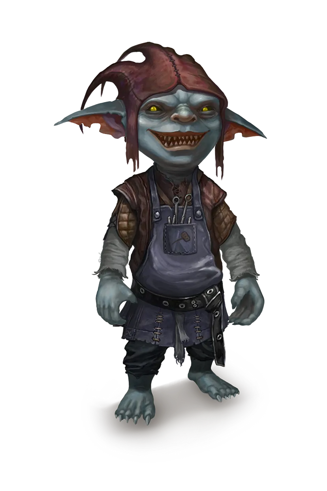

# Племена и структура общества гоблинов
Древнее государство и родина гоблинов пали во времена войны с Адомионом. Великие сокровища, знания и наследие гоблинов были утеряны безвозвратно. Война с Безумным богом и катаклизмы, последовавшие за ней, унесли с собой большую часть детей Менделефа.

Одни из последних великих гоблинов-алхимиков, кто еще помнил величие и красоту древнего государства, поклялись на крови, что покуда не будет исполнено великое пророчество, народ гоблинов не обретет новую родину. Эта клятва на протяжении сотен и тысяч лет гнала народ гоблинов в бесконечные поиски артефактов былой эпохи и истины, сокрытой в пророчестве.

За время, прошедшее после Войн Выживших, гоблины так и остались немногочисленным народом. Они расселились на некоторых землях континентов Кхела и Фарнакс и образовали несколько племен.

## Структура племени. Булэг

Общество гоблинов делится на пять групп, что зовутся булэг. Булэг — это объединение гоблинов, обладающее своими традициями и правилами. Оно представляет собой смесь кастовой структуры и ремесленных гильдий.

Гоблины, достигшие возраста двенадцати лет, принимают решение, каким ремеслом будут заниматься во взрослой жизни. И, соответственно, к какому булэг хотят присоединиться.

### Сборщики

Члены булэг занимаются выращиванием продуктов, разведением скота, а также сбором необходимых ингредиентов для приготовления алхимических зелий.

Самый известный булэг сборщиков трудится в племени лесных гоблинов. Благодаря магической природе эльфийского леса, только здесь произрастают растения, из которых добывают уникальные алхимические ингредиенты.

### Ремесленники

Эта группа отвечает за хозяйственную жизнь в племени гоблинов. Кузнецы, строители, портные и другие ремесленники состоят в этом булэг. Особенно почетное место в этом булэг занимают дарханы — мастера по изготовлению и ремонту алхимических предметов. Только опытные кузнецы становятся дарханами.

Самые искусные дарханы — это выходцы из племени Зуун Меркат. На своих повозках-мастерских они путешествуют вместе с торговыми караванами. В каждом поселении гоблинов для них есть работа по починке алхимических инструментов.

### Торговцы

Гоблины-торговцы играют важную роль в жизни племен. Они поддерживают связь и торговлю с другими народами мира Джи`Да. Булэг состоит как из мелких лавочников, торгующих на улице, так и купцов, снаряжающих большие торговые караваны во все страны.

Самый уважаемый булэг находится в королевстве Анкорлан. Местные гоблины просят называть себя Торговой Гильдией, на манер людей. Торговая Гильдия создала и руководит Банком гоблинов, известным далеко за пределами королевства.

### Алхимики

Эта группа хоть и немногочисленна, но является самой важной в племени гоблинов, так как алхимия имеет священный смысл в жизни каждого из народа детей Менделефа.

За долгие тысячелетия талант алхимии, как и его сила, стал реже встречаться среди детей Менделефа. Поэтому гоблины, у которых этот талант находят, всегда становятся членами булэга алхимиков. Существует множество сфер, где трудится алхимик: от парфюмерии и медицины до изготовления волшебных эликсиров.

### Стражи

Среди гоблинов тысячелетия назад выделилась группа, отвечающая за защиту своего народа. Если вам известны истории, где фигурирует воин или лазутчик из расы гоблинов, можете быть твердо уверены, что этот гоблин был стражем.

Защита торговых караванов от разбойников, обеспечение порядка в поселениях гоблинов — все это является заботой стражей. Именно среди Стражей возник Орден Искателей Истины, члены которого посвящают жизнь служению во имя Великого Пророчества и поиска древних артефактов гоблинов.

## Племена гоблинов
### Племя «Одинокой луны»

Представители северных земель континента Фарнакс. Имеют ряд поселений, раскинувшихся на обширной территории севера королевств Баян’Гол и Сандорн. В хороших отношениях с гномами Баянгола. Часто торгуют с ними, меняя свои зелья на гномьи инструменты и другие товары.

Особо почитаемый булэг в этом племени — Стражи. Постоянная опасность и угрозы от близости земель Северной орды орков превратила племя Одинокой Луны в самых воинственных и смелых гоблинов мира Джи`Да.

Одинокая Луна — это единственное гоблинское племя, которое отправило своих стражей на Войну Трех мечей. Оно также снабжало многие полевые госпитали восстанавливающими зельями и другими целебными эликсирами.

### Племя «Лесных гоблинов»

Гоблины, которые нашли свой приют в лесах Адриеннель. Поселились в восточных лесах королевства эльфов более тысячи лет назад. Это единственный случай, когда эльфы разрешили кому-то селиться на своих землях.

Благодаря этому лесные гоблины являются самыми многочисленными среди всех племен. Эльфы стали надежным источником защиты и процветания племени лесных гоблинов. Уникальные магические растения, растущие в этих лесах, служат отличным сырьем для эликсиров.

И нет на всем континенте лучших косметических средств, чем травяные эликсиры лесных гоблинов. Придворные дамы всех королевств и княжеств готовы выложить горы золота за возможность пользоваться ими.

### Племя «Вала`ас Хина»

Племя гоблинов, обосновавшееся в королевстве Анкорлан. В столице Анкорлан есть небольшой район, где проживают гоблины. Он находится за чертой старого города, так как пожары, возникшие в ходе экспериментов гоблинов, чуть не сожгли город триста лет назад.

После этого несчастья было решено перенести район, где могли проживать гоблины, за черту городских стен, поближе к реке Лостми. Магическая академия Анкорлана и гильдия алхимиков гоблинов давно сотрудничают в вопросах исследования магии и алхимии. Для алхимиков народа гоблинов всегда открыт свободный вход в академию.

Также в столице находится главное здание Банка гоблинов. Это финансовое учреждение, получившее широкую известность за пределами Анкорлана и имеющее широкую сеть филиалов во многих странах.

### Племя «Зуун Меркат»

Гоблины, проживающие в горах Селенг, на границе Эмирата Восточная Балхия и империи Дуджун. Давняя дружба с гномами Железного Трона позволила гоблинам научиться у них кузнечному мастерству. Благодаря этому кузнецы и дарханы Зуун Меркат считаются самыми умелыми среди всех гоблинов.

В поселениях в основном проживают женщины, дети и старики. Большая часть мужчин племени путешествует по всему континенту Кхела, иногда даже переплывая через Великое море на соседний континент Фарнакс.

Торговцы и ремесленники племени возвращаются в горы Селенг только поздней осенью, где зимуют вместе со своими семьями. Они делятся удивительными историями о приключениях, увиденных новых землях и, конечно же, об удачных торговых сделках.

Зимой алхимики племени варят эликсиры для торговли из тех ингредиентов, которые привозят из своих экспедиций мужчины, а ремесленники изготавливают новые предметы для продажи. С приходом весны мужчины вновь отправляются в торговые экспедиции в поисках новых магических ингредиентов, о которых народ гоблинов еще не имеет представления.

