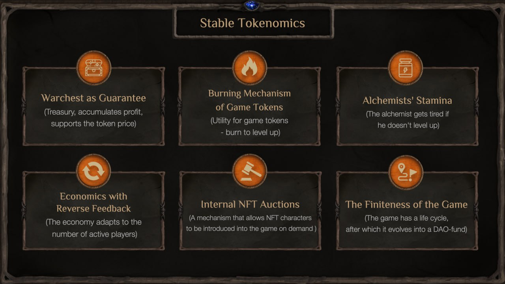
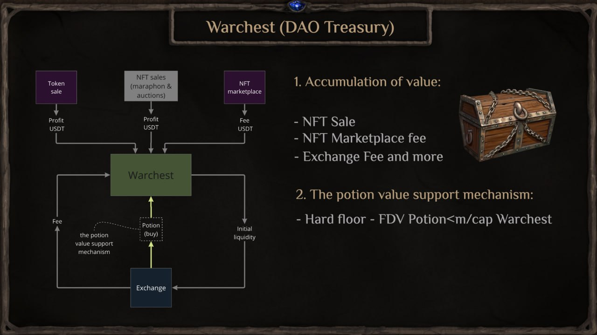
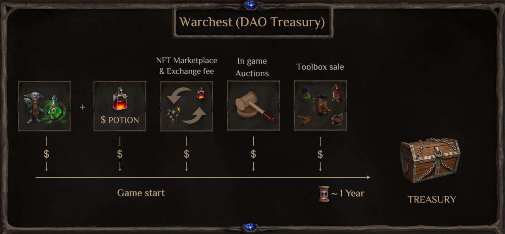
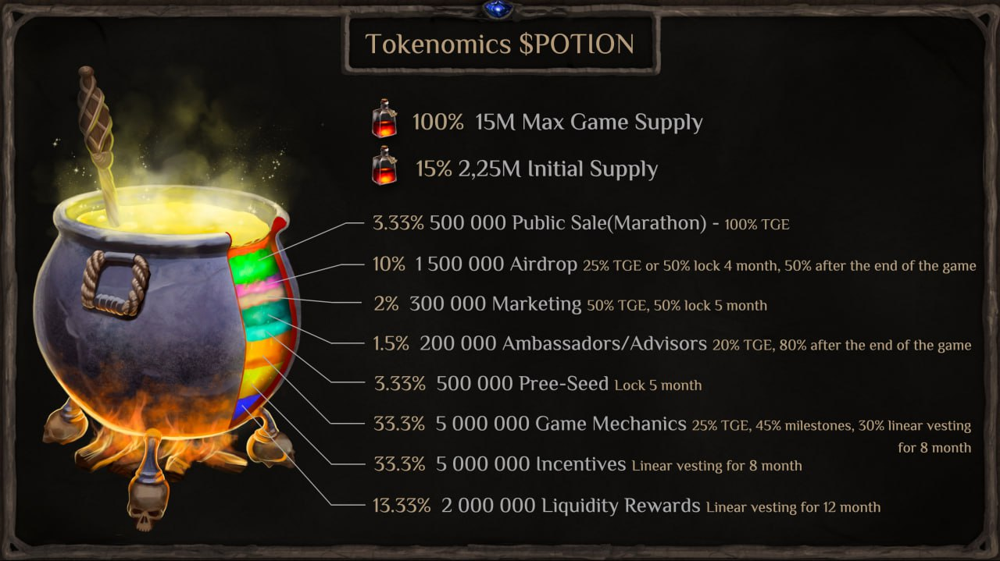
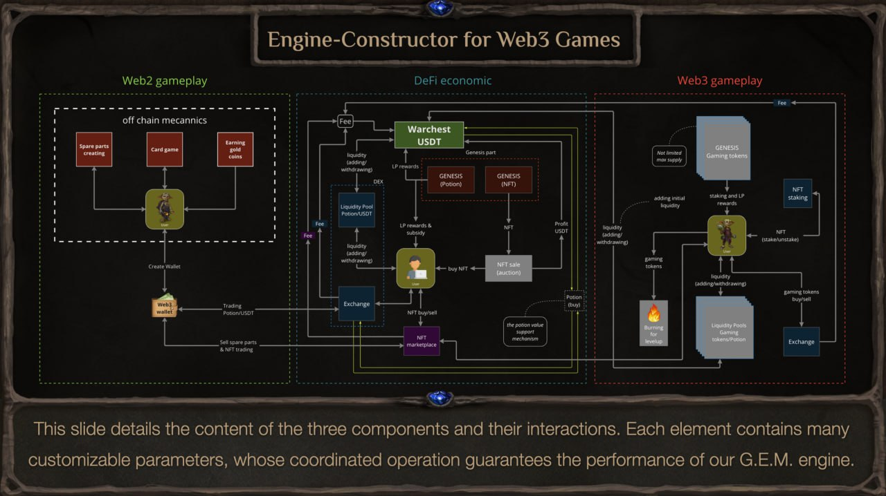
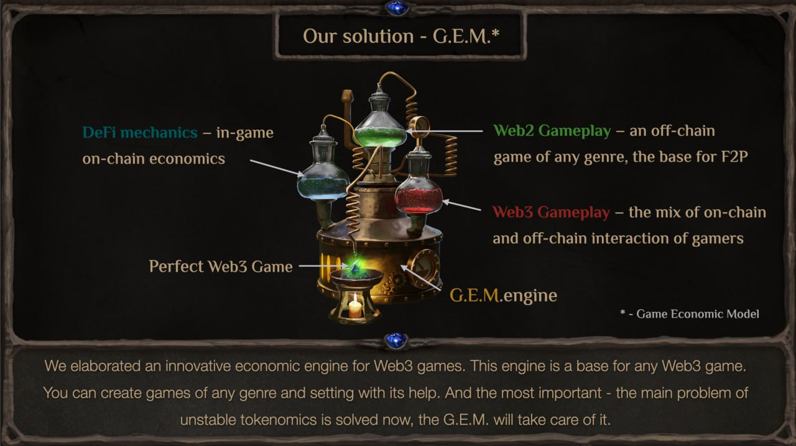
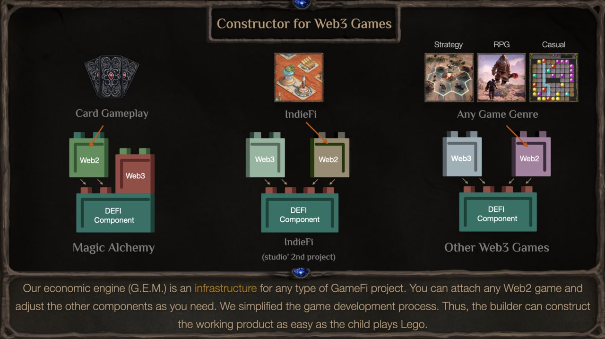
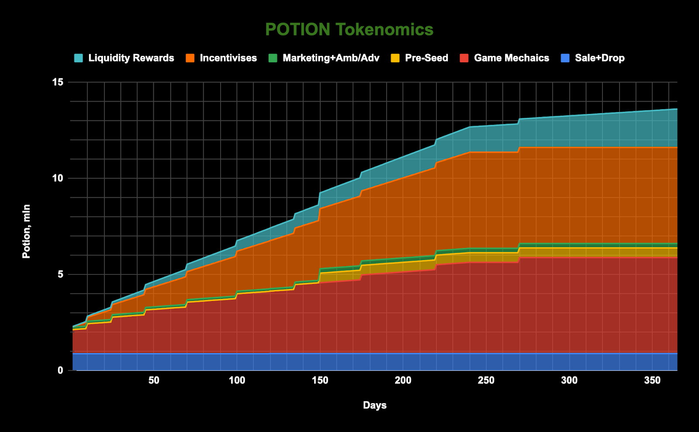
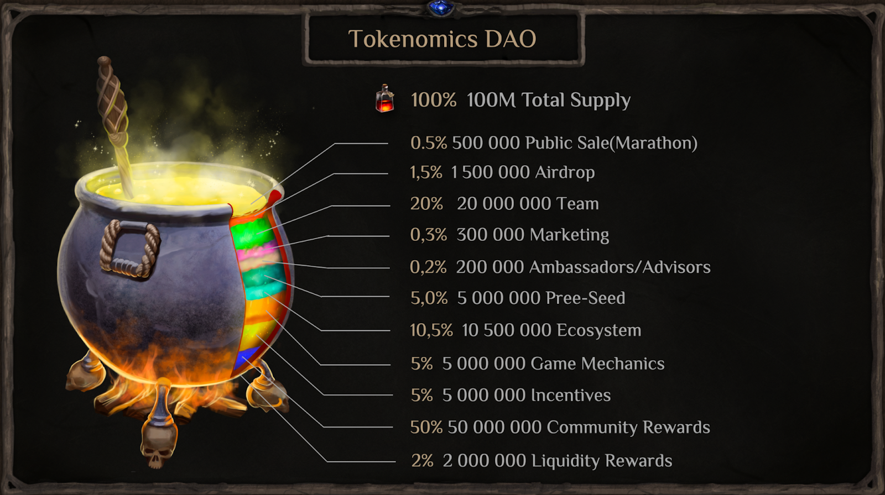

# Токеномика Magic Alchemy  
Токеномика — это сочетание слов «токен» и «экономика». Этот термин описывает все экономические аспекты, связанные с криптовалютными токенами, включая их создание, распространение, использование и управление. В данной статье мы рассмотрим основные концепции токеномики, её роль в блокчейн-экосистеме и конкретные примеры успешных моделей.

[Что такое токеномика?](#tokenomics)

[Экономика основного токена Potion](#economics)

[G.E.M.](#gem)

[Справедливость, прозрачность и доступность](#equality)

[Переход в DAO](#dao)

[Заключение](#final)

## Что такое токеномика? {#tokenomics}
Токеномика охватывает следующие ключевые аспекты:

- **Дизайн токена.** Определяет цель и функционал токена, будь то средство платежа, инструмент управления или стимул для пользователей.

- **Модель эмиссии.** Описывает, как токены создаются и распределяются, включая параметры первоначального распределения и механизмы выпуска новых токенов.

- **Управление спросом и предложением.** Учитывает факторы, влияющие на стоимость токена, такие как ограничение максимального количества токенов, механизмы сжигания, стейкинг и другие.

Токеномика является ключевым элементом успешного криптопроекта, так как от её дизайна зависит не только привлекательность проекта для инвесторов, но и его долгосрочная устойчивость.

Для достижения максимальной стабильности токеномики, были приняты следующие решения:

- Игра конечна (вероятно, впервые в Web3 играх)
- Разработан варчест (казна, принадлежащая игре)

В этом разделе представлены решения этих проблем, основанные на моделировании токеномики нашей игры с учетом игровых механик и различных форм влияния групп пользователей, являющихся неотъемлемой частью открытой экономики (промышленные фермеры, игроки, спекулянты).

## Экономика основного токена Potion {#economics}
Одна из проблем экономик крипто игр – это падение цены токенов почти до нуля. Наше решение – это варчест, который собирает все доходы игры (продажи NFT, комиссии с дексов, маркетплейсов). Варчест выполняет функцию маркетмейкинга: когда срабатывают условия хард флора (FDV Potion становится меньше количества USDT, накопленного в варчесте), варчест откупает Potion и равенство восстанавливается. Потому цена токена не может быть ниже ее фундаментальной стоимости.

Кроме того, во время игры игроки оправданно боятся больших разлоков и стараются выйти из игры до них. Структура распределения и локов токенов дает игрокам твердую веру в то, что во время игры не будет давления разлоченных токенов. 

Решение этой проблемы кроется в том, что игра конечна и длится примерно до 1 года. Благодаря этому, разлок токенов инвесторов, команды и комьюнити ревардов происходит после окончания игры. Игрок уже не боится дампа и может сосредоточиться на своих стратегиях прохождения игры.

Окончание игры связано с распределением комьюнити ревардов среди победителей и преобразованием варчеста в DAO фонд. После окончания игры инвесторы, комьюнити и члены команды в течение некоторого периода смогут обменять Potion на USDT и выйти из DAO, однако, кто останется, смогут инвестировать в другие проекты других студий, и самое главное, участники DAO будут иметь возможность проинвестировать в дальнейшие проекты студии MA Labs, которые будут финансироваться только DAO фондом.

Большая часть POTION не будет участвовать в циркулейте, так как станет использоваться Алхимиками в фарминге игровых токенов (варка зелий в котле), что снижает количество токенов в обращении. Этот механизм поддерживает баланс между спросом и предложением, предотвращая и без того небольшую инфляцию.

## G.E.M. {#gem}

Создавая игру, мы вдруг поняли, что это не просто игра. Это целый экономический движок, модель инфраструктуры, которую можно применить к любой Web3 игре.

**Ключевые компоненты этой модели следующие:**

1. DeFi — ядро, скелет игры.
2. Web3 геймплей — механика, которая задаёт правила (доступ к определённым пулам через NFT, сжигание токенов для развития и продолжения, и т.д.)
3. Web2 геймплей — оффчейн-игра, обеспечивающая плавный переход аудитории из классических игр.

Так появилась Экономическая Модель Игры (G.E.M). В нашей студии мы называем её Движком.

Наш экономический движок — это инфраструктура для любого типа GameFi проекта. Вы можете прикрепить любую Web2 игру и настроить остальные компоненты по своему усмотрению. Мы упростили процесс разработки игры, так что разработчик может построить рабочий продукт так же легко, как ребёнок строит из кубиков Лего.

## Справедливость, прозрачность и доступность {#equality}
Мы отказались от «шаблонного пути» переоценки токена на старте и выбрали долгосрочный путь, чтобы обеспечить доступность для каждого инвестора. Оценка проекта на старте будет определяться самими игроками на аукционе токенов и NFT (паблик-сейл).

Токеномика Magic Alchemy неразрывно связана с архитектурой игрового дизайна, потому что, как и сам игровой движок G.E.M, реализована нестандартно и разделена на две части:

1. Токеномика POTION во время игры Magic Alchemy
2. Токеномика POTION после окончания игры (DAO токеномика)

Разберем более подробно первую часть токеномики POTION, в которой представлены все токены, относящиеся к процессу игры до ее окончания.

Студия MA Labs придерживается принципов создания продуктов ради сообщества и для сообщества, поэтому, как видно из таблиц ниже, игрокам принадлежит почти все циркулирующее предложение во время игры (94%). Алхимикам не надо бояться разлоков инвесторов и команды (т.к у команды токены заблокированы до конца игры), что создает честные условия соревнований DeFi игроков.

Кроме того, токен POTION имеет не просто ютилити, токен является основой игры. POTION – это основная субстанция для варки зелий (механика DeFi части игры [ТУТ](../defi_2/defi_ru.md), поэтому существует как спекулятивный, так и фундаментальный спрос на токен POTION.

**Фундаментальный спрос на токен Potion определяет:**

1. покупка NFT персонажей и инвентаря
2. предоставление ликвидности в основной и игровые пулы ликвидности для фарминга наград с высокими APR

**Фундаментальная цена токена POTION определяется:**

1. количеством необходимых для игры токенов POTION, умноженным на количество Алхимиков
2. количеством купленных NFT
3. инфляцией циркулирующего предложения POTION

За счет фундаментального спроса на POTION, во время TGE и в начале игры возможен существенный дефицит POTION. Во время игры максимальное предложение токенов (Max Game Supply) ограничено 15 млн POTION, начальное предложение (Initial Supply) начинается с 2,255 млн POTION, что составляет 15%.

Временная диаграмма увеличения циркулирующего предложения POTION во время игры представлена ниже:

Так как игра Magic Alchemy конечна, но проект продолжит жить и трансформируется в DAO, игровая токеномика переходит в токеномику DAO, в которой Total Supply равняется 100 млн POTION, из которых 50 млн (ровно половина) распределяется в качестве наград за достижения в игре.

Таблица с Total Supply представлена ниже:

Важно отметить, что в DAO токеномике важную роль играет SAFU фонд или варчест, в который собирается вся прибыль с продажи различных NFT и комиссий пулов и маркетплейса. Варчест также является поддержкой ценности наград Алхимиков, т.е. Варчест является обеспечением токена POTION в DAO токеномике.

Именно поэтому POTION защищен от падения цены до 0. Варчест наполняется твердой валютой USDT, а также доходов с комиссий карточных игр на RUSK.

## Переход в DAO {#dao}
После окончания игры, ликвидность, предоставляемая варчестом в пулы ликвидности изымается и в течение некоторого периода (до 2 недель) владельцы POTION могут обменять свои токены POTION на активы варчеста пропорционально своей доле.

Либо, оставшись владельцем POTION, стать полноправным членом DAO MА Labs и продолжить развитие, выйдя на новый уровень. Члены DAO будут иметь возможность приоритетного инвестирования на выгодных условиях в проекты студии MA Labs и других студий, ценящих сплоченное сообщество.

**В конце игры будет не продажа токенов в “стакан”, а прямой обмен через контракт варчеста на USDT.**

Например, игрок Онотоле имеет на руках 1000 POTION + за сезоны он заработал 10000 POTION, которые заблокированы до окончания игры. В конце у него есть несколько опций:

- Полностью обменять свои 11000 POTION на USDT по курсу варчеста, который рассчитывается по формуле USDT в Варчесте/Циркулейт POTION
- Обменять часть POTION на USDT, а часть оставить в DAO
- Полностью оставить свои POTION в DAO

## Заключение {#final}
Токеномика Magic Alchemy — это инновационная и продуманная экономическая модель, сочетающая в себе принципы устойчивого развития и гибкости. Она нацелена на создание справедливой, стабильной и прозрачной игровой экосистемы, которая не только поддерживает интерес игроков, но и защищает их активы от обесценивания.

**Основные преимущества токеномики Magic Alchemy:**

1. Сбалансированная структура распределения токенов — значительная часть токенов отводится на игровые механики и вознаграждения, стимулируя активное участие игроков.
2. Контроль инфляции и поддержка цены токена — механизм варчеста обеспечивает стабильность стоимости токенов, предотвращая резкие обесценивания.
3. Четкая система локов и вестинга — создает доверие у игроков и инвесторов, минимизируя риски дампов.
4. DAO-модель управления — после завершения игры экономическая структура переходит в формат DAO, где участники смогут продолжить развитие проекта, инвестировать в новые инициативы и управлять будущими решениями.

Magic Alchemy — это не просто игра, а комплексная платформа, предлагающая игрокам и инвесторам новые возможности в мире GameFi. Уникальная модель распределения токенов и система защиты активов создают уверенность в будущем проекта. Мы верим, что эта система станет эталоном для других игр в Web3-среде, вдохновляя разработчиков на создание новых, увлекательных и безопасных для пользователей игровых миров.