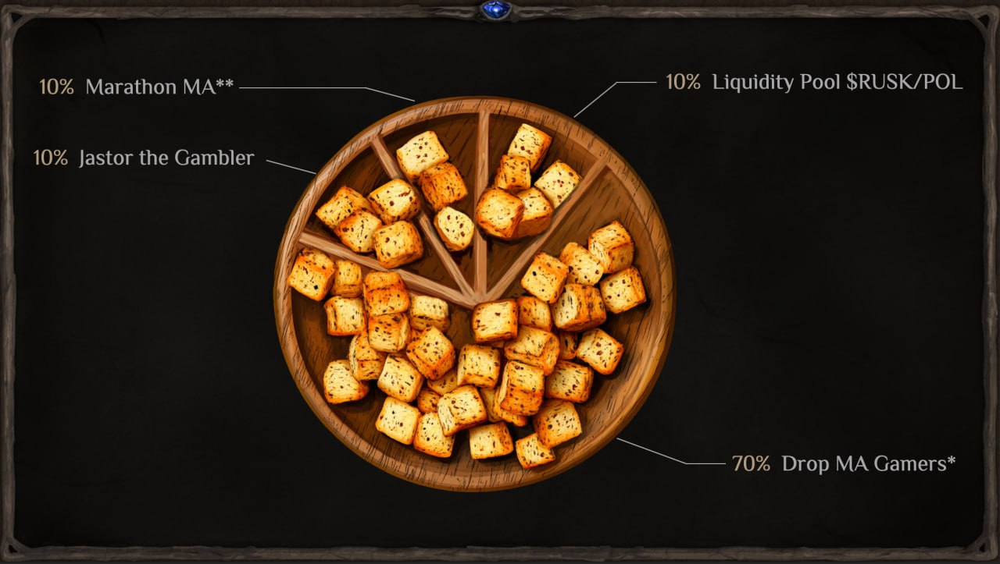

# $RUSK Tokenomics

Hey everyone! You’ve probably heard the saying, *“Every joke has a grain of truth in it.”* Well, one of the pranks in our chat spiraled out of control, and what started as a simple meme has now become a full-fledged reality!

Friends, the next time someone asks, *“Wen drop, sir?”* you can confidently point them to this article. Here’s the infographic showing the token distribution for $RUSK:

**Unclaimed drops will be burned.*

***Tokens will be distributed immediately after the Marathon.*

## Let’s break down the numbers:
- 700M — Airdrop
- 100M — Marathon
- 100M — Liquidity
- 100M — Jastor (reserve)

To claim your $RUSK, head over to the Fallen Moon Tavern and find Glob. He’s back from his *rehab vacation* and currently spending his days sampling Bagbir’s finest stout!

Rusks Have a Claim Deadline: 1 Week (7 Days).

$RUSK is not just a meme token — it’s a vibrant reminder that even jokes can become something more when fueled by an active and creative community like ours.

Remember, goblins: this is all JUST FOR FUN. Don’t take it too seriously, don’t obsess over the price. Just find Glob, grab your rusks, and enjoy the ride!

**Dexscreener**: https://dexscreener.com/polygon/0x9ba3a271cce3e93c05d35e66b15d25ac51478206

**Uniswap**: https://app.uniswap.org/swap?outputCurrency=0x231878d973C09fBCc0CA2239fFfb717795402cB4&chain=polygon