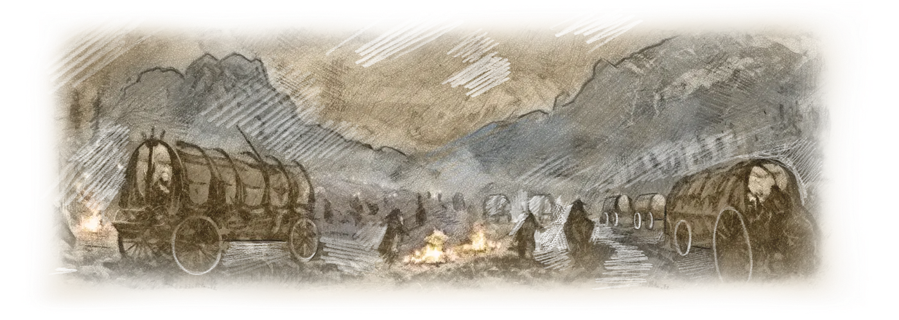
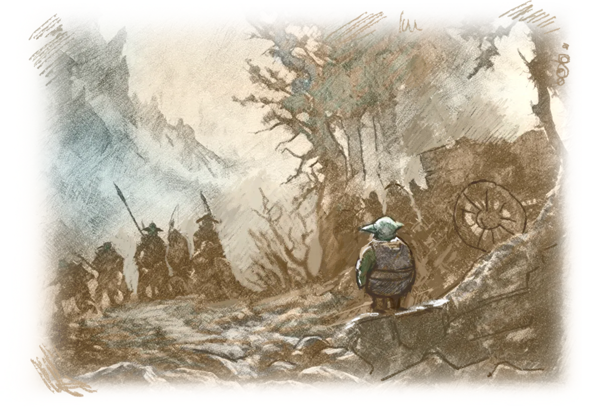
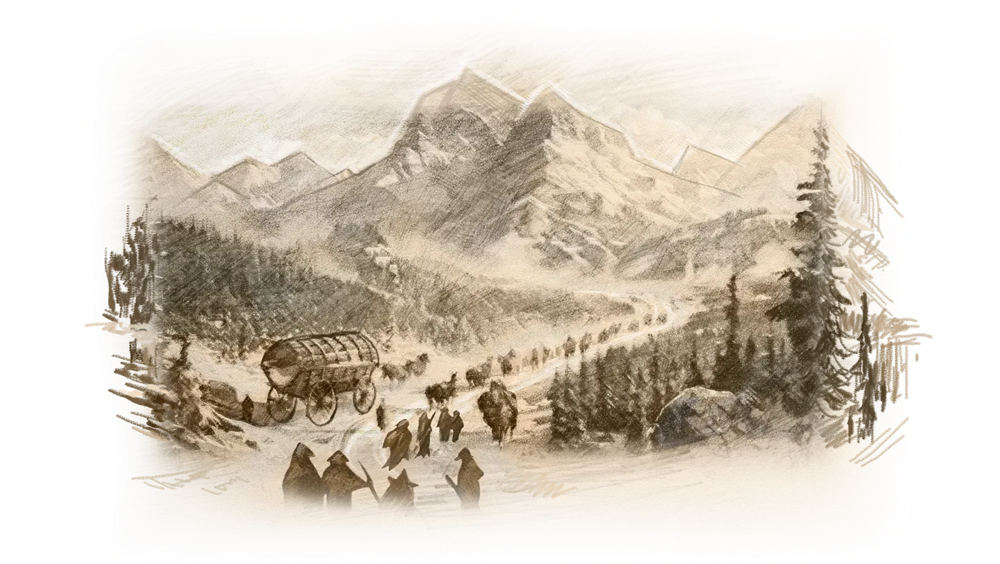
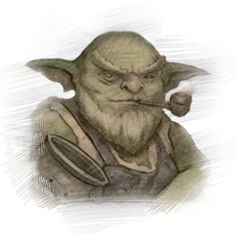
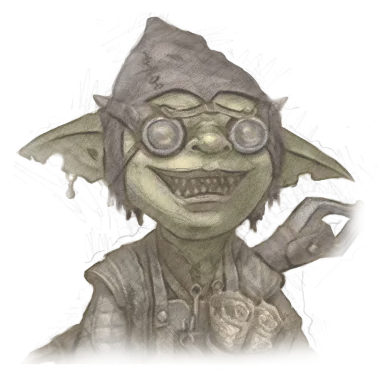

Возвращение домой
=================

Зимнее солнце медленно поднималось из-за заснеженных пиков Замковых гор.

Наступал очередной день великого переселения гоблинов из племени Зуун Меркат.

Улзар помогал отцу складывать вещи в повозку и готовить ее к дороге. Ночной лагерь гоблинов уже наполнился шумом и гамом. Сотни возничих запрягали яков, лошадей и выстраивали повозки в походный порядок, согласно своему заранее оговоренному месту в колонне.

Молодой дархан ненадолго остановился, чтоб еще раз посмотреть на уже виднеющиеся вдалеке горные вершины. Конечная цель путешествия находилась рядом и ждала их в глубине Замковых гор. Скрытая долина Эхорон, древняя родина всех гоблинов, наконец, была найдена.

Это событие повергло в шок всех без исключения детей Менделефа. Пророчество, которое многие гоблины считали легендой или мифом, оказалось истинным.

Новость об обретении древней родины отзывалась радостью в сердце каждого гоблина, но на душе у всех было тревожно, ведь пророчество повествовало о страшных событиях, которые должны были обрушиться на весь мир в ближайшем будущем.

* *Отец, я помню, ты говорил, что в этих местах небезопасно, и что даже на большие торговые караваны нападали разбойники. Мы точно можем вот так в открытую путешествовать? —* спросил Улзар, складывая палатку.
* *Улзар, ты вроде не глупый у меня. Посуди сам, ну кто будет нападать на нас, когда здесь все наше племя? Тем более, нас сопровождает булэг Стражей, —* ответил Дазар, проверяя упряжь Уголька.

В подтверждение слов Дазара из леса неожиданно вышел пеший отряд гоблинов и приблизился к голове колонны. Это разведчики Стражей прибыли с докладом о том, что впереди нет опасности для переселенцев.

Разбойники, промышлявшие в этих краях, на своей шкуре прочувствовали, что бывает, если отравленный дротик гоблинов попадает в тело человека. Так что они как можно скорее убрались из этих мест.

Прошло совсем немного времени, и огромная колонна начала свой путь к подножью гор. Сотни разномастных телег и повозок медленно катились по промерзшей земле королевства Эртеланд.

И если яркие и цветные повозки торговцев из племени Зуун Меркат уже были знакомы в королевстве, то вид остальных вызывал большое любопытство у всех, кто видел их впервые.

Огромные повозки булэга Сборщиков, которые издали можно было принять за амбары на колесах. В них хранились запасы провианта, а также саженцы и семена растений, которые будут посажены в земле вновь обретенной родины. То были как обычные овощи и злаки, так и редкие уникальные растения, необходимые для алхимических зелий и эликсиров.

Величественные и украшенные причудливой вязью магических символов повозки алхимиков, из печных труб которых часто вырывались снопы разноцветных искр.

Даже в дороге те не прекращали варить магические зелья.

Каждый гоблин, даже ребенок, знал примету, что если алхимик варит зелье, то рядом всегда есть дархан. Так было и здесь. Среди многочисленных повозок ремесленников ярко выделялись мастерские дарханов.

Группу из передвижных мастерских возглавляла повозка мастера Дазара. Он был известен среди всех гоблинских племен, и никто не удивился, что именно его повозка возглавляла булэг Ремесленников.

* *Отец, а правду говорят, что все племена нашего народа должны вновь объединиться? —* спросил Улзар, взбираясь на подножку повозки.
* *Правда. Мне известно, что племя Вала`ас Хина уже покинуло Анкорлан. Они прибудут вторыми после нас в Эхорон. Еще пришли новости, что Одинокая Луна и Лесные гоблины тоже в дороге. Правда, здесь они будут не скоро, ведь им предстоит плыть с Фарнакса, другого континента.*
* *Сейчас алхимики всех племен спешат попасть в долину Эхорон, где была открыта истина слов пророчества и найдена обитель нашего отца, Тара Менделефа, хранящая знания и мудрость первых великих алхимиков. Так что готовься, скоро у нас с тобой прибавится работы. У всех дарханов прибавится,* — произнес Дазар, набивая свою трубку. Затем мастер-кузнец окликнул Уголька, своего яка, подгоняя его.

Повозка дархана медленно тронулась вперед. Караван переселенцев племени Зуун Меркат продолжил свой путь к горам, виднеющимся вдалеке.
