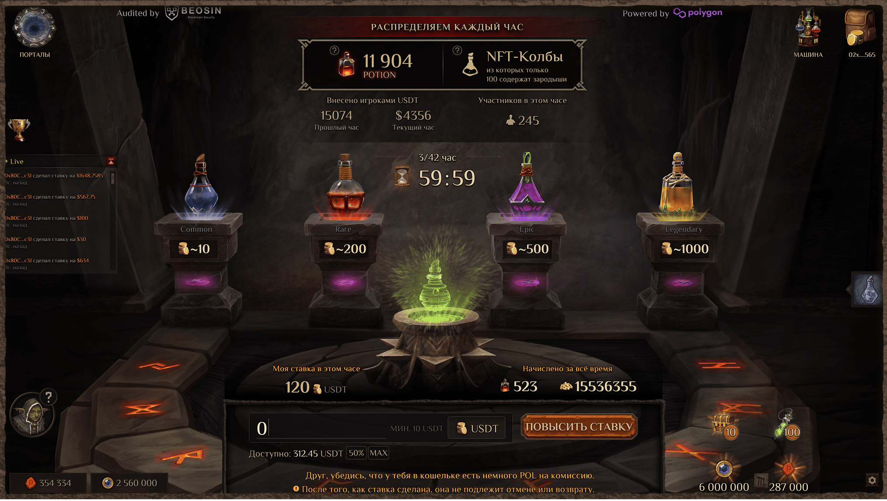
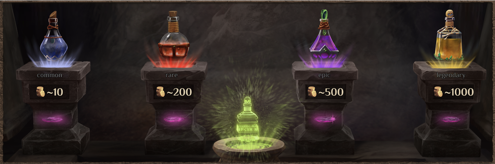
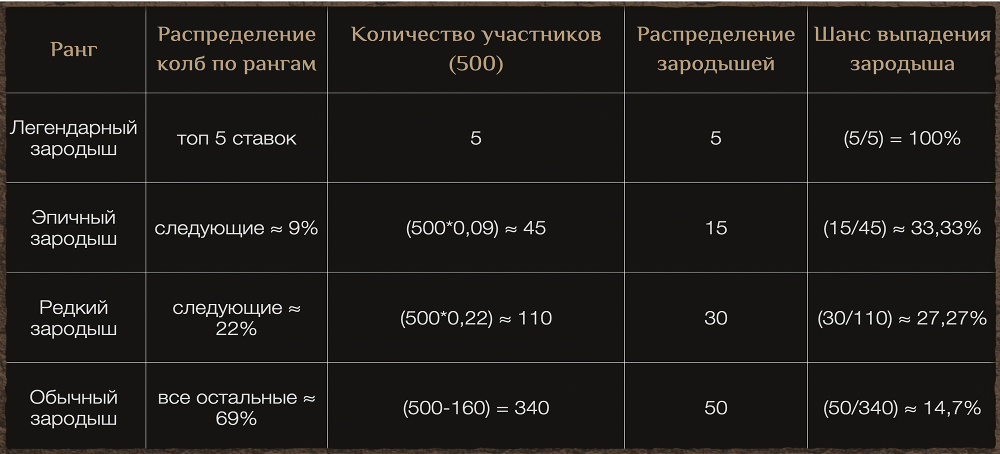

# Марафон Токенов и NFT MA

---

При поддержке POLYGON

- [Важность сообщества и его роль в нашей игре](#community-role)
- [Аукцион токенов POTION](#potion-auction)
- [Механика распределения токенов POTION](#potion-distribution)
- [Аукцион NFT](#nft-auction)
- [Механика распределения Колб Менделефа](#mendelyef-flasks)
- [Я — легенда!](#i-am-legend)
- [Пару слов в завершение](#conclusion)

---

[Ссылка внутри игры](/world/tavern)

[Ссылка на другую статью](../../articles/Статистика_по_бете/Статистика_по_бете_ru.md)

Рады приветствовать вас, Алхимики!

_Magic Alchemy @magicalchemy — 24 октября 2024_

После нескольких лет упорной и напряженной работы по разработке нашей игры, Magic Alchemy, мы, наконец, стоим на пороге главного события, которое предваряет релиз игры. Речь идет о публичной продаже токенов POTION и главных игровых персонажей, NFT алхимиков.

Публичная продажа токенов всегда является очень важным событием для любого Web3 проекта, ведь это дает всем желающим возможность поддержать полюбившийся проект и получить токены по хорошей цене.

Наш проект не исключение, но мы с самого начала говорили, что мы за инновации и нестандартный подход в разработке. Поэтому мы решили провести уникальный вариант аукциона токенов, совместив его с продажей главных игровых персонажей.

Этот этап будет представлять собой аукцион, на котором игроки, делая ставки, будут соревноваться между собой за токены POTION и NFT алхимиков. Длиться этот этап будет ровно 42 часа, поэтому мы решили назвать его “Марафон токенов и NFT”. Такой большой временной отрезок означает, что каждый желающий сможет успеть принять в нем участие.

Почему мы остановились на такой форме проведения публичной продажи токена POTION?

## Важность сообщества и его роль в нашей игре {#community-role}

Мы считаем, что “ранние пташки” – первые, кто поддержал нашу игру, являются нашим главным активом. Благодаря вам, нашему сообществу, мы убеждались в правильности нашей идеи и нашего подхода в создании Magic Alchemy. Многие ваши мысли и предложения мы использовали в своих разработках. Можно даже сказать, что все наше ламповое сообщество является соавтором нашей игры.

Поэтому мы придерживаемся мнения, что “ранние пташки” имеют право воспользоваться своим положением. Это может выразиться в возможности первыми обладать не только уникальными игровыми предметами или персонажами, но и материальным преимуществом.

Ведь первые игроки, которые получат игровые токены POTION, благодаря Марафону Токенов и NFT, имеют шанс стать теми, кто первыми смогут предоставить ликвидность в фарминге Magic Alchemy. А так как мы позиционируем себя геймифицированной DEX биржей, то и многие механики DeFi будут в нашей игре. Например, высокие награды — APR для тех, кто предоставляет ликвидность при запуске пула POTION/USDT. Это даст возможность приумножить свои игровые активы первым участникам.

С выпуска альфы прошел почти год (декабрь 2023). Мы намеренно не продавали NFT и токены. Напротив — только бесплатно раздавали USDT (карточные турниры) и NFT (кружки, гоблины, повозки). Это концепция Win‑Win. Сначала мы отдавали и формировали сообщество и только сейчас подходим к этапу, когда вы, наше коммьюнити, можете нас поддержать, но не донатами, а участвуя в этом увлекательном ивенте.

А теперь давайте подробно разберем механики аукциона токенов и NFT.

## Аукцион токенов POTION {#potion-auction}

Всего через Марафон токенов и NFT будет реализовано 500 000 токенов POTION и 100 000 000 $RUSK. Сам Марафон будет длиться 42 часа, соответственно, каждый час будет продаваться ≈ 11 904 токена POTION и бонусом начисляются (не продаются) 2.38 млн $RUSK.

Игроки, делая ставки, будут участвовать в распределении токенов в конкретном часе, в котором они сделали ставки. При этом игроки будут так же получать за них NFT‑Колбы Менделефа, о которых речь пойдет позже.

Важно напомнить, что все ставки на аукционе токенов невозвратные и не могут быть отменены.

## Механика распределения токенов POTION {#potion-distribution}

Представим, что Онотоле решил участвовать в 10‑м часу Марафона и поставил 100 долларов. В этом часу общая сумма ставок составила 15 600 долларов. Чтобы рассчитать количество токенов, делим ставку игрока на общую сумму ставок и умножаем на общее количество токенов POTION в часу (также рассчитаем количество $RUSK, которые получит игрок):

- 100$ / 15 600$ × 11 904 POTION ≈ 76,3 POTION
- 15 600$ ÷ 2,38 млн $RUSK = 0,0065
- 100$ ÷ 0,0065 = 15 384 $RUSK

Значит, за свои 100 долларов Онотоле получит примерно 76 токенов $POTION и 15 384 $RUSK. Чтобы вы не запутались, мы позаботились о демонстрации всех важных элементов, включая количество USDT, которые вы поставили. Это поможет вам принимать решения о ставках.

## Аукцион NFT {#nft-auction}

Одновременно с открытой продажей токенов POTION будет проходить аукцион по распределению NFT Колб Менделефа. Это будет один и тот же аукцион с продажей токена. Игроки, делая ставки в нем, могут получить не только токены, но и шанс на главного игрового персонажа – Гоблина‑алхимика. Только владея им, игроки смогут участвовать в главной DeFi части игры Magic Alchemy.

Всего у нас в игре будет 4444 NFT генезисных алхимиков. Они будут 4 рангов:

- Коммон — 2222 шт
- Редкий — 1342 шт
- Эпик — 660 шт
- Легендарный — 220 шт

Марафон будет длиться 42 часа, а значит, участвовать смогут все желающие. В каждом часе участник сможет получить только одну Колбу Менделефа. Это означает, что максимум один участник сможет накопить до 42 Колб Менделефа, возможно содержащих до 42 зародышей гоблинов‑алхимиков.

Всего за аукцион распределится 4200 NFT зародышей Гоблинов‑алхимиков, но NFT‑Колб Менделефа будет больше, чем 4200 шт. Почему их будет больше? Это мы разберем ниже.

В каждом часу среди всех сминченных Колб Менделефа будут распределены: 5 легендарных, 15 эпичных, 30 редких и 50 коммон алхимиков. Итого каждый час будет распределяться своя часть Колб Менделефа, содержащих 100 зародышей гоблинов‑алхимиков. 244 NFT зародышей гоблинов‑алхимиков (10 легендарных, 30 эпичных, 82 редких, 122 коммон) автоматически уходят в казну — фонд для розыгрышей и наград.

## Механика распределения Колб Менделефа {#mendelyef-flasks}

Распределение Колб Менделефа будет зависеть от размера вашей ставки.

Минимальная ставка для получения коммон Колбы Менделефа будет равна 10 USDT. Делая такую ставку, вы гарантировано ее получите. В течение часа участники могут добавлять любую сумму к размеру ставки. Чем больше сумма ставки, тем выше шанс получить колбу более высокого ранга.

Пример со стратегиями игроков… (см. оригинал для полного FAQ).

## Я — легенда! {#i-am-legend}

Мы хотим рассказать о ценности и утилитарности наших Алхимиков. Как мы писали ранее, в игре будет представлено 4444 NFT генезисных Алхимиков, разделённых на 4 редкости:

- Коммон — 2222 шт.
- Редкий — 1342 шт.
- Эпический — 660 шт.
- Легендарный — 220 шт.

Главная ценность Алхимиков заключается в том, что только их владельцы смогут участвовать в основной DeFi части игры — Magic Alchemy (жанр LP2Play).

После Марафона начнётся этап, на котором игроки смогут стейкать своих Алхимиков и получать за это награды в токенах POTION. В зависимости от редкости алхимика будут применяться разные коэффициенты наград.

## Пару слов в завершение {#conclusion}

Мы уверены, что участники Марафона токенов и NFT по достоинству оценят наше новаторство и получат удовольствие, опыт и азарт от аукционов. Здесь всё зависит только от вас — честное распределение токенов и равная борьба за редкие NFT.
