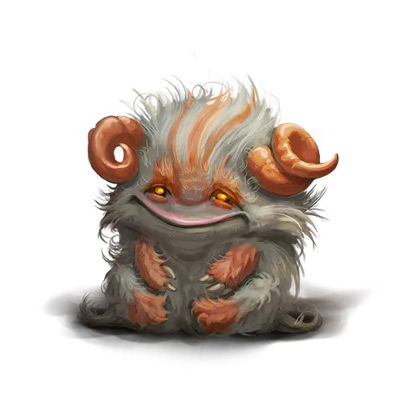

О существах магических. Часть 4
===============================

Данная информация по вновь обретенным магическим существам составлена на основе немногочисленных сохранившихся древних записей и дополнена исследованиями члена Верховного Магического Совета Академии Анкорлана, Виталиусом, а также ученых Ордена Ищущих Истину. В древних хрониках не указано, для каких целей содержали магических существ. Тем не менее, неоспоримым фактом является то, что все они были ручными фамильярами магов и алхимиков прошлого.

Бигачу
------

В мифах народов, проживающих на территории современной Империи Дуджун, есть упоминание о волшебном существе Бигачу, обитающем высоко в небе и повеливающим молниями и громом. По сохранившимся изображениям в древних письменных источниках, это существо похоже на медведя с двумя витыми рогами на голове.

Найденный гоблинами фамильяр точно совпадает с описанием внешнего вида этого Бигачу. Поэтому мною было принято решение назвать его также, как в легендах народов империи Дуджун. Бигачу и правда можно принять за небольшого рогатого медвежонка, только, в отличии от медведей, они являются травоядными животными.

Я склонен считать, что на заре Новой Эпохи первые переселенцы на территории современной Империи Дуджун, сталкивались с Бигачу. Причем, вероятно, то были последние представители данного вида со времен Золотой Эпохи, что выжили в дикой природе. И со временем, по мере того, как Бигачу становилось все меньше, память об их необычных способностях стала легендой, а легенда стала мифом.

Бигачу, как и все другие фамильяры, обладают уникальными свойствами. И если насчет способности летать легенды наврали, то бить молниями Бигачу еще как умеют. Каким-то непостижимым образом эти создания способны вырабатывать и сохранять в своем теле магическую энергию, которая материализуется в виде молнии по желанию фамильяра.

Я думаю, что обитающие в дикой природе Бигачу пользуются этим, чтобы давать отпор крупным хищникам. Эмпирическим путем мною было доказано, что Бигачу способны регулировать силу своей молнии. Давайте здесь подробнее.

В ходе эксперимента с молниями Бигачу я испытывал лишь легкое покалывание по коже, а вот с одним из гоблинов, который помогал мне в лаборатории, произошел пренеприятный случай. Я попросил его специально дразнить и злить Бигачу, чтобы посмотреть, что произойдет. Бедолагу в буквальном смысле поджарили. Слава Юэве, в тот момент в лаборатории находились алхимики — они отпоили гоблина своими зельями.

Не знаю почему, но гоблин перестал посещать лабораторию после того случая. Теперь мне самому приходится убираться в ней и готовить материалы для исследований. Прискорбно.
