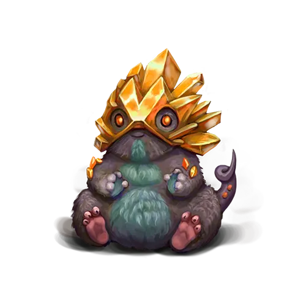

О существах магических. Часть 5
===============================

Данная информация по вновь обретенным магическим существам составлена на основе немногочисленных сохранившихся древних записей и дополнена исследованиями члена Верховного Магического Совета Академии Анкорлана, Виталиусом, а также ученых Ордена Ищущих Истину. В древних хрониках не указано, для каких целей содержали магических существ. Тем не менее, неоспоримым фактом является то, что все они были ручными фамильярами магов и алхимиков прошлого.

Гемодавр
--------

Весьма примечателен последний из обнаруженных фамильяров. Внешне он мне напоминает один вид грызунов, что водится в лесах западных земель Триумвирата Вентурия. Только гемодавры крупнее и, разумеется, обладают присущей всем другим фамильярам волшебной особенностью.

Свое название гемодавры получили, следуя информации из сохранившихся источников. Эти существа могут отращивать на голове минералы, образующие своеобразный защитный шлем.

Сначала наблюдаемые мной гемодавры не имели на голове этих минеральных наростов, но буквально через несколько дней они начали появляться на голове у всех гемодавров, которых к тому времени удалось обнаружить.

Я посчитал, что эти наросты есть нечто наподобие костяных чешуек броненосцев из восточных земель Балхии, но каково было мое удивление, когда выяснилось, что собранные мной образцы имеют минеральное происхождение. Мои предположения подтвердились после того, как я попросил алхимиков из племени Зуун Меркат проверить и определить природу этих образцов.

Их опыты показали, что данные минералы по своей структуре больше напоминают искусственно выращенные магические кристаллы, нежели естественные минеральные образования. При этом, со слов алхимиков, они имеют удивительно сложную и чистую структуру. Даже гоблинам не всегда удается вырастить в своих лабораториях такие комплексные по своей структуре кристаллы.

Я в который раз убеждаюсь в магическом происхождении всех найденных гоблинами фамильяров, так как иначе объяснить способность живого организма выращивать на своем теле я не могу.

Гемодавры вызвали особенный интерес со стороны алхимиков. В ходе исследований они открыли поистине удивительную вещь — эти кристаллы обладают удивительными свойствами. Кое-кто из алхимиков даже назвал их идеальными катализаторами всех алхимических процессов. Звучит интригующе, что бы это ни значило. Единственное, что я понял: используя кристаллы гемодавров, можно в несколько раз быстрее приготовить любое магическое зелье или эликсир…

… Как же замечательно, что волей судьбы меня занесло в это место. Я уверен, что мое имя попадет в историю как первого ученого, которому довелось подробно изучить и записать все те удивительные вещи, что еще сокрыты во вновь обретенной земле детей Менделефа. Научный совет Академии Анкорлана еще попросит, чтобы я вернулся в альма-матер и позволил читать там свои лекции обо всех своих открытиях!
