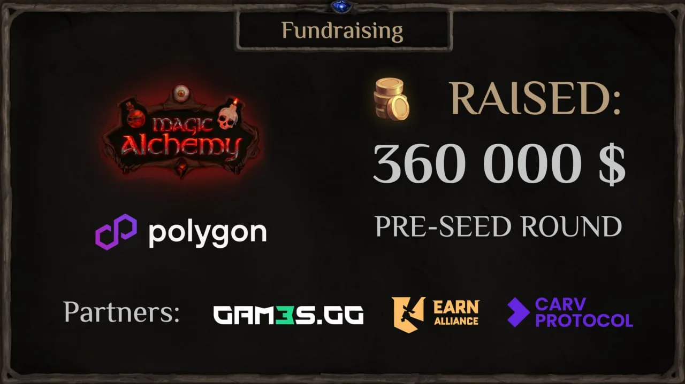
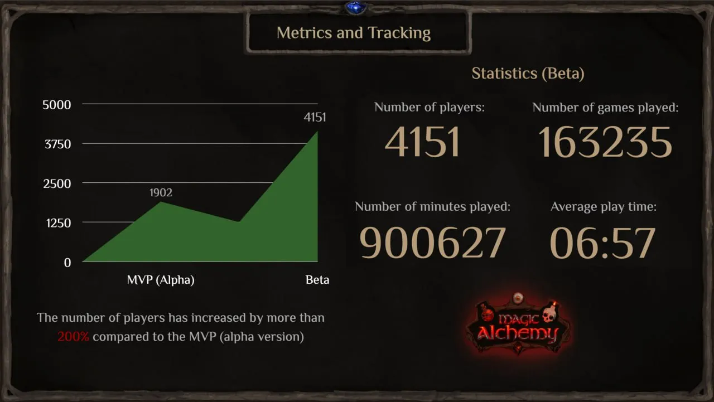
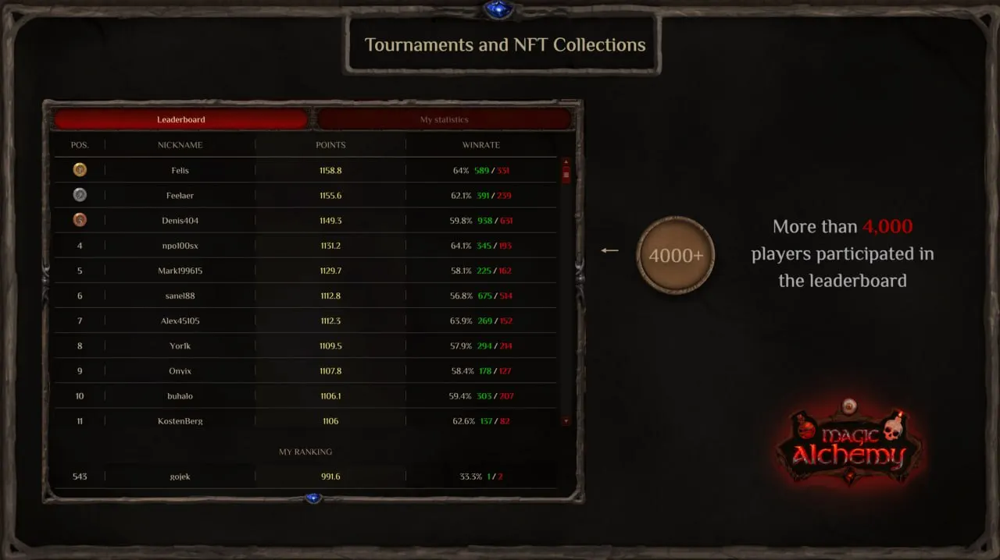
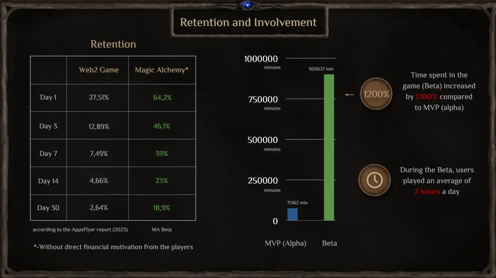

Статистика по бете
==================

**Magic Alchemy** — это соревновательная **DeFi-игра** на собственном **DEX** движке с уникальным методом онбординга **Web2** в **Web3**.

Проект поднял **Pre-Seed раунд** в **$360 000** и получил грантовую поддержку от **Polygon**. **Magic Alchemy** — Т**оп 1** игра в **программе Polygon Village**.

Нашими партнерами являются **Earn Alliance**, **Gam3s’GG** и **Carv Protocol**.

Немного цифр и статистики по **бете**:

* Кол-во уникальных игроков: 4151

* Кол-во сыгранных партий: 163235
* Кол-во партий вничью: 357
* Кол-во сыгранных минут: 900627
* Среднее время партии: 00:06:57
* DAU 1000+

* Ретеншн D1–64%, D7–39%, D30–18% (нет платного входа в виде NFT или токенов)

[Website](https://magicalchemy.org/) | [Twitter](https://twitter.com/magicalchemydao) | [Discord](https://discord.gg/MMdJ9zw6cc) | [Telegram](https://t.me/magicalchemychat) | [Gitbook](https://docs.magicalchemy.org/)
