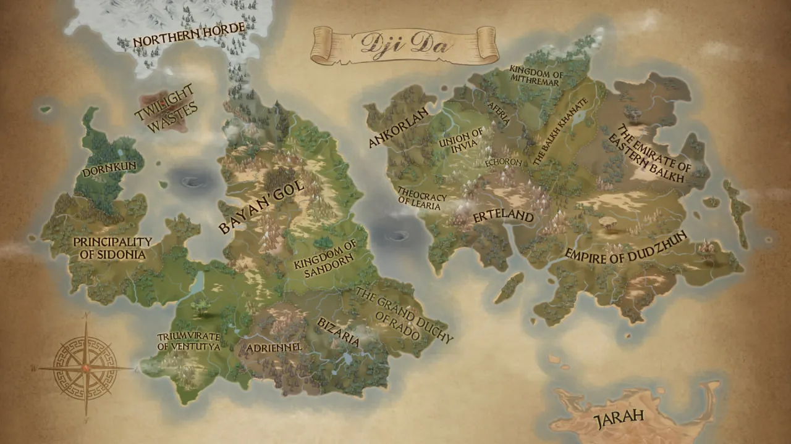
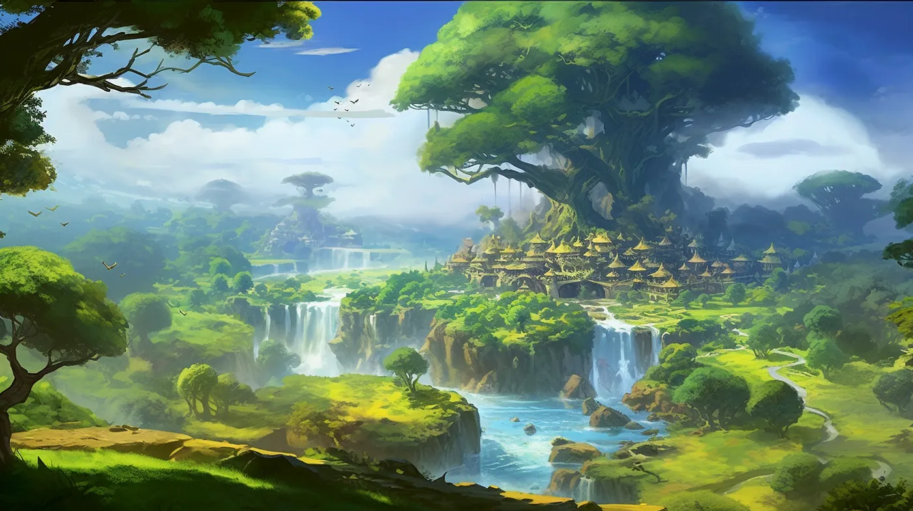
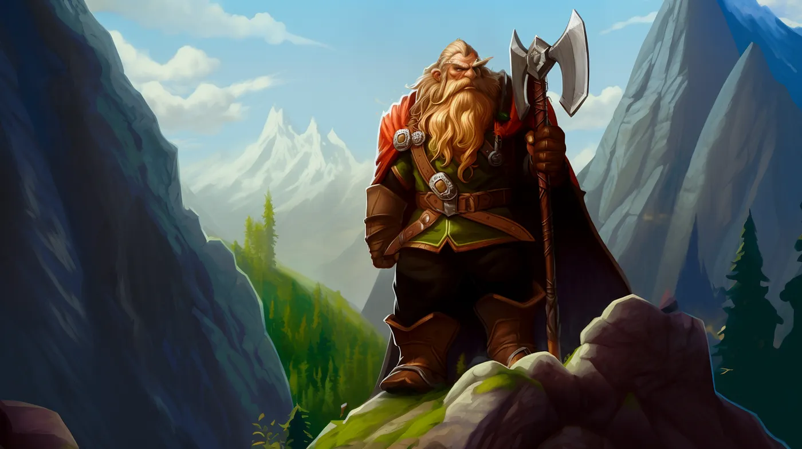
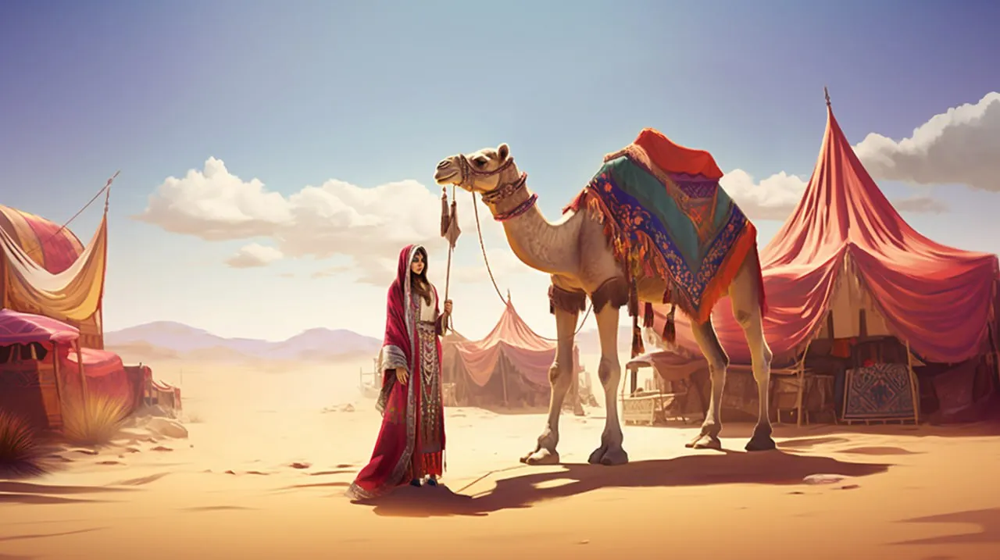
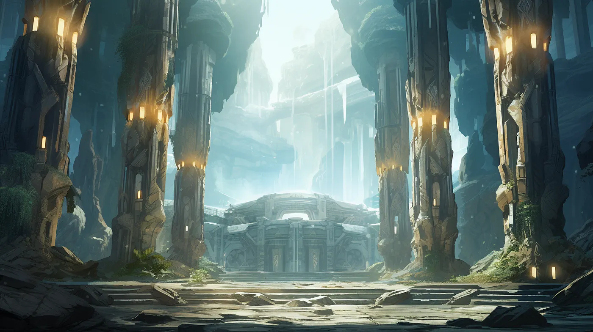

Страны мира Джи’Да. Часть 4
===========================

**Королевство Аферия**
----------------------

Королевство Аферия смотрит на Море Штормов, зажатая между государствами Инвиа и Митремар, и имеет общие южные границы с Балхийским ханством. На всем континенте лишь королевскому дому Аферии дозволено вести торговлю с эльфами Митремара. Дело в том, что далекий предок правящей королевы Таишет дон Парланк Пятой помогал эльфам во время Великой засухи.

В благодарность эльфы наделили потомков короля Аферии правом вести с ними торговлю. Эта уникальная возможность позволила королевству приумножать свои богатства на протяжении долгих лет.

Столица Улет охватывает оба берега реки Фенфри. В её огромной бухте, всегда наполненной иноземными кораблями, ни на день не останавливается шумная и бойкая торговля.

Последние сто лет Аферия ведёт пограничные войны с сильным и воинственным соседом — Балхийским Ханством. Для Балхии Аферия и ее богатства всегда были лакомым куском. Ханы Балхии давно открыто заявляют, что хотят сделать королевскую династию Парланк своими вассалами.

Однако золото, вырученное от торговли с эльфами, позволяло правителям Аферии нанимать вольные команды из соседнего государства Инвия. Эти наёмники всегда сполна отрабатывали свое жалование, так что военные походы Балхии ни разу не увенчались победой.

**Королевство Митремар**
------------------------

Королевство лесных эльфов. Страной руководит королева Мераэль Ньевен Ясноокая, дочь Филвендора Благочестивого, Хранительница Древа, чьей красотой и мудростью восхищаются барды всего континента Кхела. В балладах её красоту сравнивают с красотой восхода солнца на берегу Этрейского моря, а ум и мудрость с остротой и величием пиков Холодных Гор.

Как и эльфы Адриеннеля, лесные эльфы строго следят за сохранностью своих лесов и территорий. В древние времена люди совершали попытки захватить Митремар, но все они разбивались о мощь эльфийских воинов и магии.

В свою очередь, королевство Митремар никогда не пыталось захватывать соседние земли, всегда оставаясь лишь в границах своих лесов. За многие поколения люди свыклись с этим устоем, так что ныне только отправляют торговые и дипломатические миссии в вечнозеленые леса Митремара.

Королевство Хада-Нор
--------------------

Во времена Войн Выживших гномы континента Кхела укрылись в горах Колдании. В этой неприступной цепи гор они создали подземное королевство со столицей Кормард. Их подземные владения уходят на многие мили вглубь горных недр.

Гномы Хада-Нор не любят покидать свои владения и мало интересуются делами, которые происходят в мире на поверхности. Только во время войны с людьми за земли хребтов Норнии в первом тысячелетии армия гномов покинула пределы гор Колдании.

После окончания тех войн гномы смогли наладить мирные и торговые отношения с людьми королевства Эртеланд — к взаимной выгоде обеих сторон. И, во многом благодаря торговле с Хада-Нор, королевство Эртеланд стало таким процветающим.

Изделия горных мастеров Хада-Нор высоко ценятся по всему миру. И, если качеством и прочностью изделий гномы Баян`Гол не уступают своим восточным братьям, то вот вниманием к отделке гномы Хада-Нор на голову превосходят гномов Баян`Гол. Даже самый простой кухонный нож, созданный кузнецами Железного трона, выглядит как настоящее произведение искусства.

Сейчас на Железном Троне восседает и правит король Ганунд Широкий, представитель древнего королевского гномьего рода Хада-Нор.

Балхийское ханство
------------------

В этих землях горы были богаты полезными ископаемыми, а долины — плодородны и давали обильный урожай. Еще с древнейших времен первые переселенцы, обосновавшиеся на территории сегодняшней Балхии, оказались обеспечены глиной, камнем, металлами и другими вещами, необходимыми для жизни.

Всё это позволило многим древним и богатым культурам континента Кхела быстро расти и развиваться на этих землях. Немало королевств и империй зарождалось и погибало на бескрайних равнинах и нагорьях Балхии, но восемьсот лет назад образовался союз племен, ставший позже единым государством — Великая Балхия.

Просуществовав около шестисот лет, Великая Балхия распалась в ходе дворянского мятежа на два государства: Балхия и Эмират Восточная Балхия. Данные события подробно описаны в хрониках “История государства Балхия. Рассвет и закат” за авторством историка Варения Асекского.

Регулярные войны между странами, бывшими когда-то одним государством, длятся на протяжении двухсот лет с переменным успехом то одной, то другой стороны.

Эмират Восточная Балхия
-----------------------

Страна, образовавшаяся в ходе мятежа группы дворян восточных провинций Балхии. Конфликт возник более двухсот лет назад из-за отказа хана Османа Пятого признать своим наследником старшего сына от первой жены, дочери великого эмира Ланийского. Эмир являлся самым богатым дворянином в Балхии, с самолюбием столь же огромным, как и его состояние.

Этот инцидент, а также повышение налогов на товары из восточных провинций и вызвал дворцовый переворот. Началась междоусобная война, приведшая к разделению ханства на два отдельных государства.

Богатство Восточной Балхии издревле основывалось на сельском хозяйстве, коневодстве и торговле. Важнейший торговый путь между империей Дуджун и Великой Балхией проходил по ее территории.

Торговые караваны пересекали пески жарких пустынь, чтобы доставить специи, драгоценные породы древесины, шелк, янтарь и другие товары из Империи Дуджун в Балхию. Из эмирата же в империю перегоняли табуны лучших пород лошадей на всей Кхеле, а также экспортировали ценнейший ланийский мрамор, нефрит, лазурь, алебастр и известные далеко за пределами Балхии ковры.

Скрытая долина Эхорон
---------------------

Земля, которая находилась в долине, сокрытой Замковыми горами. Тысячелетия никто из смертных не знал о существовании Эхорона.

Отвесные горы, вздымающиеся на мили в высь. Бездонные пропасти, бесконечные лабиринты пещер, из которых даже гномы не могли найти выход. Туманы, что плотной завесой висели в горах, никогда не рассеиваясь — все это не позволяло путешественникам найти проход среди гор.

Только недавно одна из поисковых групп гоблинов нашла путь среди подземных пещер в эту долину. Там они обнаружили заброшенные руины древнего города гоблинов времен Золотой Эпохи.

