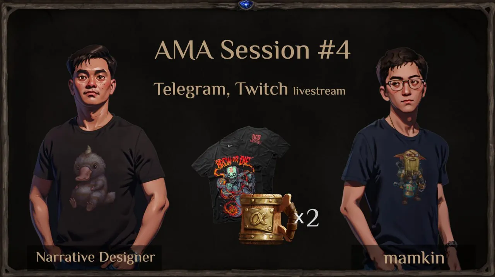

**The Fourth AMA Session Magic Alchemy (Final Before the Marathon)**

Hello everyone! Here’s a brief summary of our fourth AMA, the final one before the start of the NFT and POTION Token Marathon. If you’re interested in more detailed answers to the questions, check out the [FULL VIDEO](https://youtu.be/H807vMfoYJc?si=-f2Zdd5084LgoxNK) on YouTube.

**00:00:07 — Speaker Introduction**

This is the final AMA before the POTION Token and NFT Alchemist Character Marathon. During this session, Andrey, CEO of MA Labs, and Alexander, narrative designer, will answer questions regarding the marathon. Over 50 questions were received, and the most interesting ones have been selected.

**00:03:31 — Number of NFT Pets and Ways to Obtain Them**

Currently, there are 88 NFT pets, but additional small collections are planned, with a maximum of 100 pets in each.

**00:04:02 — How Much USDT Should Be Reserved for Maximum Farming Rewards in the POTION/USDT Pool?**

The USDT cap in the pool will be dynamic, depending on the pool (there are 10 pools in total) and the average liquidity. It may range from $500 to $1,000.

**00:06:41 — Will the Goblin Bank Continue Operating After the Marathon?**

The Goblin Bank will remain operational after the marathon, but essence generation will stop. An alternative method to increase points will be introduced later.

**00:07:34 — How Frequently Will the Marathon Leaderboard Be Updated?**

Updates will occur with a 20–30 second delay, displaying the top 300 positions and the participant’s position.

**00:08:40 — What Is the Minimum Bet Amount During the Marathon?**

The minimum bet per hour is $10, with a $1 increment step.

**00:09:36 — When Will the Prizes for the First-Hour Lottery Be Paid?**

Payouts will likely happen after the marathon, though payouts during the marathon will be considered if the prize pool in USDT is small.

**00:11:09 — Are You Planning to Add a Replay Feature in Card Games?**

We are currently working on automated tournament specifications, which will include a spectator mode. Where there’s a spectator mode, replays will follow.

**00:11:41 — Will the First Bet Bonus Apply Only Once or Throughout the Marathon?**

Yes, the first bet bonus will apply throughout the marathon. The first bet can be placed in any hour.

**00:12:43 — Giveaway Conditions During the AMA Stream**

A giveaway of two NFT mugs and a Blood Alchemist T-shirt will happen on Alexander’s Twitch channel (Lormd03). Participants must write “AMA” in the stream chat.

**00:13:53 — Will Funds Be Automatically Withdrawn from Staking Before the Marathon, and Is There a Reason to Keep Them Afterward?**

Funds won’t be automatically withdrawn, and keeping them in staking after the marathon is pointless. You’ll earn more essence and gems by participating in the marathon.

**00:14:36 — Can Bets During the Marathon Be Made from the Goblin Bank Deposit?**

No, you will need to unstake and place bets manually.

**00:14:48 — Will There Be Additional Ways to Earn Silver?**

Alternative ways to earn silver, apart from tower gameplay and pet feeding, will be introduced post-game release.

**00:15:59 — What Are Your Future Ambitions?**

We are already working on our next game about space. Additionally, a Magic Alchemy prequel featuring dwarf brewers is in the works, incorporating new mechanics using our economic engine.

**00:17:42 — Will NFT Alchemists Have Value in Future Projects?**

Mugs and possibly wagons will carry over to the prequel game. The fate of alchemists remains uncertain, but there may be drops for owners in future projects.

**00:19:19 — Is It Worth Creating a Second Account with Two NFT Alchemists?**

Yes, because after the marathon, there will be an event called “First Alchemist, Get Ready.” Alchemists will farm POTION tokens, so spreading them across “family” wallets makes sense.

**00:22:41 — Why Do Alchemists Have Growth Potential in Value?**

Alchemists farm POTION tokens, which are embedded in them, making them derivative assets or options on future tokens.

**00:24:51 — How Will 224 Goblin Alchemists Be Added to the Prize Pool?**

NFT Alchemists will be stored in the warchest as embryo NFTs. Winners will need to purchase Ugly Broth to grow them into adult alchemists, stimulating the secondary market.

**00:26:53 — What Happens if Fewer Than 200 Bets Are Placed in Most Marathon Hours?**

From 100 and up to 167 bets the math of calculating the presence of an embryo in flasks without interest, you might say. As long as 22% of the distribution of rare flasks/embryos from the total number of bets, is less than distributed 30 rare embryos to a flask per hour, then rare flasks and respectively embryos contained in them are exactly 30, and epics 15. When 22% is more than 30 bets, but 9% is less than 15 bets, then rare by percent counts, and epics are always 15. When there are 167 or more bets, everything is counted by percentages.

At 200 stakes, the probability of getting an epic germ would be about 60%, and an epic agly broth would be 40%. In case of a shortage of agly broths, an exchange of Common agly broths for epic broths will be offered at a ratio of 1 to 2, 1 to 3 or 1 to 4, the exact value will be determined later.

**00:29:28 — First NFT Mug Giveaway Winner**

Winner: Lifer00.

**00:34:05 — What Will Be Used for In-Game NFT Purchases After the Game’s Release?**

All in-game NFT purchases will be made using POTION tokens.

**00:35:54 — How Will New Players Be Attracted?**

Plans include partnerships with streamers, with some already streaming the game. The marketing budget is used efficiently, avoiding overspending. A simplified version of the game is planned for Google Store, Apple Store, and Steam to attract free-to-play players.

**00:43:57 — Should I Create a Weak Guild or Join a Strong One?**

If your guild is weak, competing for leaderboard prizes will be difficult. Joining a stronger guild is a better option.

**00:45:46 — Will Additional USDT Be Needed for the DeFi Part of the Game?**

Additional USDT may not be needed depending on how much was contributed during the marathon. For example, a $10,000 contribution might require no further funds. Extra contributions are generally beneficial for liquidity.

**00:48:53 — How Can Players Ensure the Warchest Funds Are Secure and Transparent?**

Funds cannot be withdrawn by the developers, as this is enforced through smart contracts. All transactions will be visible on the blockchain, and the wallet address will be public.

**00:52:36 — Is Staking Croutons Planned?**

No, staking croutons is not a good idea.

**01:39:01 — Setting a Precedent in the GameFi Industry**

The marathon could establish a new precedent in the Web3 gaming industry.

**01:40:20 — Closing Remarks from Andrey**

We believe the dual-auction mechanic is fair and could become a new standard for token launches, avoiding the downsides of traditional sales, ICOs, and IDOs. This format may be adopted by other projects using a White Label model.

See you at the marathon. Good luck to everyone!

With love, mamkin and the Magic Alchemy team.
