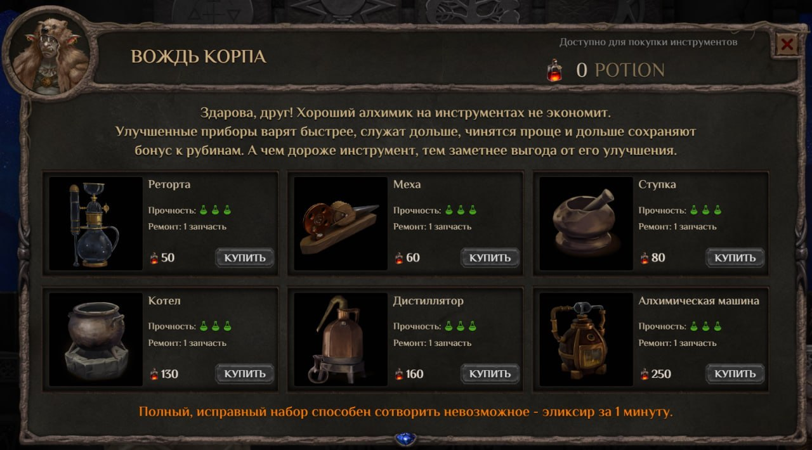

🧪 Обновление лаборатории в Magic Alchemy

Приветствуем вас, алхимики! ⚗️

В игре появились улучшенные инструменты, которые можно приобрести у Корпы! Кроме того, в лаборатории теперь доступен инвентарь, делающий взаимодействие с инструментами удобным и понятным.

Улучшенные инструменты устанавливаются на стол так же, как и базовые, но их главное преимущество — повышенная прочность:
* **Базовый инструмент:** выдерживает 1 варку, для ремонта нужны 2 запчасти.
* **Улучшенный инструмент:** выдерживает 3 варки, для ремонта нужна всего 1 запчасть.

💰 Покупка улучшенного инвентаря происходит за POTION. Вы можете приобрести его на премаркете уже сейчас. Важно: один и тот же тип улучшенного бустера можно покупать в любом количестве.

В будущем починка сломанного инструмента, вероятно, станет выгоднее его замены, так что планируйте свою стратегию заранее. Также улучшенные инструменты со временем начнут сокращать время варки эликсиров.

Это обновление — важный шаг к превращению лаборатории в полноценную систему управления ресурсами и эффективностью. На данном этапе прочность не уменьшается, но вы уже можете обустроить свою лабораторию новыми инструментами!

Лаборатория становится глубже. Готовьтесь планировать варки и строить свою экономику. 🧪
