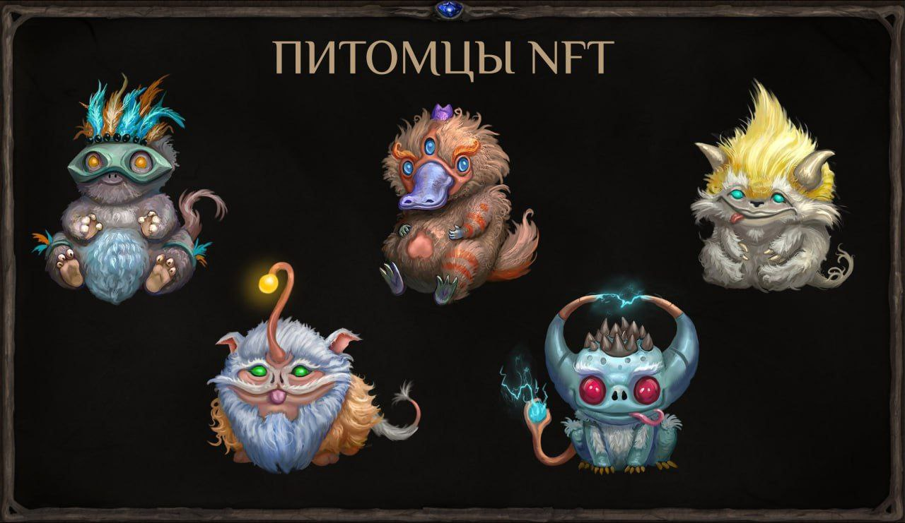

NFT-питомцы теперь приносят больше серебра 💰

Маг-учёный Виталиус завершил исследования фамильяров, трансмутировавших во время эпидемии Жёлтой Чумки. Теперь питомцев можно безопасно размещать в комнате гоблина, а их польза стала заметно выше.

При ежедневном кормлении прибыль растёт по прогрессии:
🔹 1 день — 50 серебра
🔹 2 день — 100 серебра
🔹 3 день — 150 серебра
🔹 4 день — 300 серебра
🔹 5 день — 900 серебра

Обновление особенно выгодно для игроков, которые регулярно отправляют торговые караваны за ресурсами: питомцы стали полноценным экономическим помощником.
