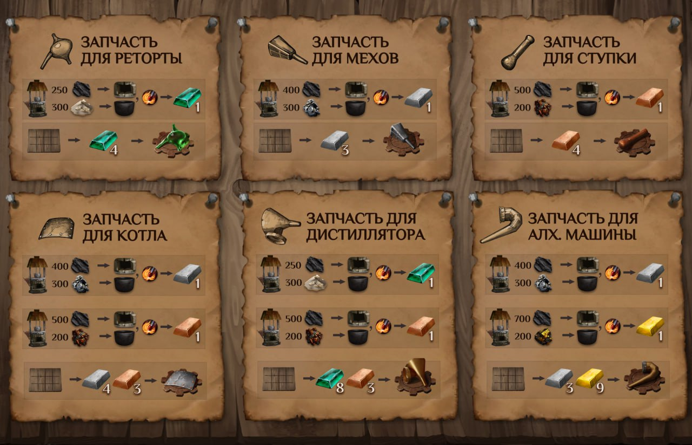

Верстак в повозке-мастерской запущен 🔧

Мастер-дархан Дазар завершил инспекцию вашей повозки-мастерской и разрешил гоблину-ремонтнику работать за верстаком.

Теперь в повозке можно изготавливать первые запчасти для алхимических приборов. В ассетной и NFT-повозке производство проходит заметно быстрее, поэтому вы сможете быстрее готовить оборудование и развивать свою алхимическую мастерскую.

Разжигайте плавильню, доставайте кузнечные молоты и запускайте производство.
