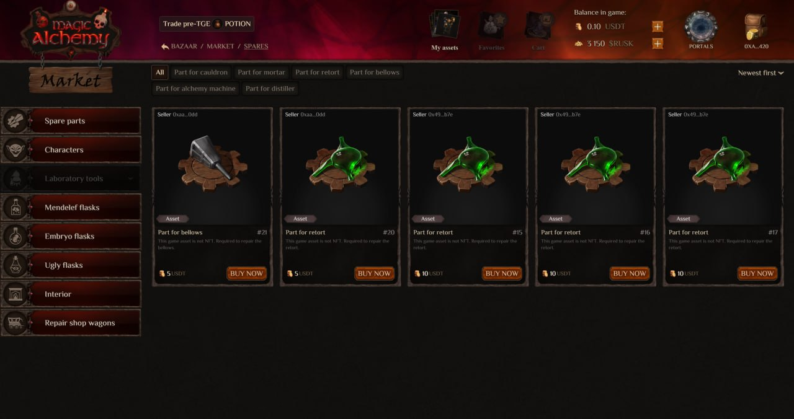

🏪 Marketplace Opening in Magic Alchemy

Greetings, alchemists! ⚗️

You've been waiting for this since the Bazar location opened. And the moment has finally arrived — we are opening the Magic Alchemy internal marketplace.

Now in the Bazar location, you can check out the shop on the right and start using our market. At launch, trading for alchemy booster parts is available. But this is just the beginning – with the game's release, the assortment will expand significantly, and you'll be able to trade other in-game items as well.

⚙️ **Important:**
Currently, the market works with asset items. All NFTs are still traded on external platforms such as OpenSea and Element.

We had to slightly modify the original marketplace functionality to speed up development and bring the game's release closer.

💰 Start trading, take your place as a pioneer, and be among the first to build your economy in the new market.

✨ May Mendelef's blessing be with you.
