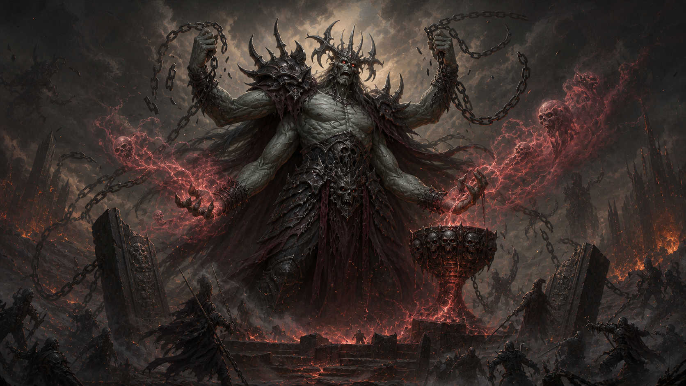

🔥 Adomion Awakens

Greetings, alchemists.

The ancient prophecy has come true before its appointed time: Adomion has awakened. The Academy failed to restore the recipe of the Divine Elixir, the potion that once held the Mad God in slumber. Formulas have scattered, archives are burning, the roads of Dji'Da are emptying, and the last survivors are gathering where a lit doorway still remains open — at the Fallen Moon tavern.

With this update, Magic Alchemy enters the age of the last survivors. The great campaign is over, but the tavern remains open: you can still play cards, wager RUSK, listen to rumors, drink stout with Glob, and keep contact with the alchemists who have not disappeared after the fall of the Academy.

What changed:
* the Fallen Moon tavern is now the main point of the game and a refuge for survivors;
* the card game remains available, including games played for RUSK;
* silver is no longer a goal to accumulate: some card victories now grant symbolic "Respect +" instead;
* RUSK remains the last valuable currency in these difficult times;
* the wallet now includes a section for withdrawing and recovering assets from closed locations;
* a warning about Dynamic wallets has been added: do not delay moving assets to real Web3 wallets;
* a new [Legendarium article](https://magicalchemy.org/world/library?article=articles%2Flegendarium_8_2%2F8_adomion_s_premature_awakening_en.md) explains Adomion's premature awakening.

What to do next:
* recover assets left in old locations, banks, wagons, or staking;
* move anything valuable from custodial Dynamic wallets to your own Web3 wallets;
* keep your RUSK if you want to continue playing with the last currency of the Fallen Moon;
* track RUSK on [Dexscreener](https://dexscreener.com/polygon/0x9ba3a271cce3e93c05d35e66b15d25ac51478206) and use [Uniswap](https://app.uniswap.org/swap?outputCurrency=0x231878d973C09fBCc0CA2239fFfb717795402cB4&chain=polygon) if you want to refill your supply;
* check the [Academy channel](https://t.me/alchemania) and the chats [@magicalchemychat](https://t.me/magicalchemychat), [@magicalchemygamechat](https://t.me/magicalchemygamechat) for the latest records from the survivors.

This is not the ending the alchemists were working toward. But as long as the light still burns in the Fallen Moon, the story of Dji'Da is not over.
